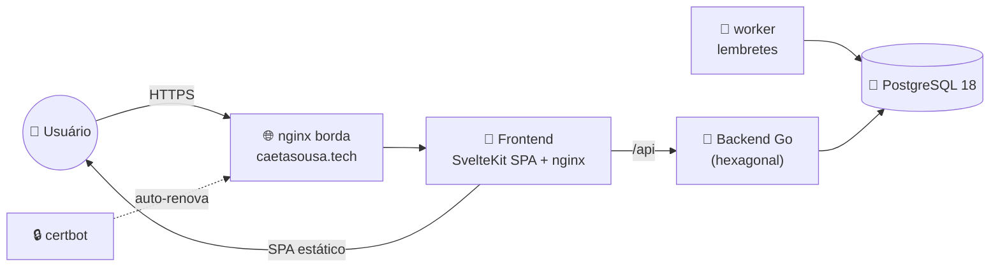

# 🐹 annyGo


App de plano de estudos para concursos: backend em Go (arquitetura hexagonal), frontend SvelteKit, Postgres, e nginx/HTTPS na frente — tudo provisionado via Ansible. Nasceu do artefato `claude.ai/code/artifact/ffbfa732…` (planejador de estudos do TCE-GO B02); o design e o motor de geração do plano foram preservados.

> [!TIP]
> Arquitetura, convenções de código e regras de projeto completas estão em **[CLAUDE.md](CLAUDE.md)**. Este arquivo é só o caminho do zero até rodando.

---

## 🧰 Stack

| | Tecnologia | Papel no projeto |
|---|---|---|
| 🐹 | **Go 1.27** | backend hexagonal (`domain / port / service / adapter`), sem framework web, `net/http` puro. Motor do plano em `internal/domain/plano` (port fiel do `construir()` do artefato, travado por golden test) |
| 🧡 | **SvelteKit 2 / Svelte 5** | frontend SPA (`adapter-static`, `ssr = false`), runes, tokens de design copiados do artefato |
| 🐘 | **PostgreSQL 18** | banco da aplicação — modelo multi-concurso genérico, TCE-GO B02 como seed |
| 📜 | **SQL puro** (sem ORM) | migrations à mão (`NNNNNN_nome.up/down.sql`), runner próprio em `platform/db` (embed + `schema_migrations` + advisory lock) |
| 🔐 | **argon2id + JWT** | hash de senha (argon2id/PHC) e auth (access curto + refresh com rotação) |
| 🔔 | **worker** | `cmd/worker` — lembretes diários de revisão espaçada (D-1/D-7/D-30). Adapter atual só loga; e-mail fica pra depois |
| 🐳 | **Docker + Compose** | `postgres + backend + worker + frontend`. Imagens multi-stage; na VPS roda só as imagens (via `ansible/deploy.yml`) |
| 🌐 | **nginx** | reverse proxy de borda na VPS → container do frontend (que serve o SPA e faz proxy de `/api` pro backend). Nativo (`apt`/`systemd`) pra integrar com o certbot |
| 🔒 | **Let's Encrypt / certbot** | HTTPS de `caetasousa.tech`, renovação via `certbot.timer` |
| 📕 | **Ansible** | provisiona a VPS (`site.yml`) e faz deploy do stack (`deploy.yml`) — idempotente |
| 🖥️ | **Hostinger VPS** (Ubuntu 24.04 LTS) | onde a infra roda |

---

## 📐 Arquitetura em 1 minuto



Um hexágono só (`domain / port / service / adapter`), sem separação por bounded context — mantido simples de propósito. Detalhes em [CLAUDE.md](CLAUDE.md#architecture).

---

## 📋 Requisitos

| Ferramenta | Pra quê | Obrigatório? |
|---|---|---|
| 🐳 Docker + Compose | rodar o stack inteiro | ✅ sempre |
| 📕 Ansible | provisionar/gerenciar a VPS | ⚙️ só pra infra |
| 🔑 `sshpass` | bootstrap inicial da VPS | ⚙️ só na 1ª vez |
| 🐹 Go 1.27+ / 🟢 Node 24+ | testar backend/frontend fora do Docker | 💤 opcional |

---

## 1️⃣ Clonar

```bash
git clone <url-do-repo>
cd annyGo
```

## 2️⃣ Rodar local

```bash
cp .env.example .env      # defina JWT_SECRET (o resto tem default)
docker compose up -d --build
# abre o app:
open http://localhost:5173
curl http://localhost:5173/health   # {"status":"ok"} (via proxy do frontend)
```

Cadastre uma conta na tela de registro e o plano do TCE-GO B02 aparece com as datas do edital já preenchidas. Para desenvolver o frontend com hot-reload: `cd frontend && npm install && npm run dev` (proxia `/api` pro backend do compose).

> [!NOTE]
> O único segredo dessa parte é o `JWT_SECRET` no `.env` — pode ser qualquer string longa localmente.

## 3️⃣ Infraestrutura (VPS) — só na primeira vez, por servidor

> [!IMPORTANT]
> A **única coisa** que você precisa fornecer em algum lugar é a senha de root da VPS (a que a Hostinger gera na criação — hPanel → VPS → Overview). Ela nunca é salva em arquivo: é digitada direto no prompt do Ansible e descartada logo em seguida.

```bash
cd ansible

# 🔑 1. Gera a chave de deploy (pule se já existir)
ssh-keygen -t ed25519 -f ~/.ssh/annygo_deploy -N "" -C "annygo-deploy"

# 📝 2. Copia os templates e preenche com os valores reais
cp inventory/hosts.ini.example inventory/hosts.ini
# edite inventory/hosts.ini: ansible_host = IP real da VPS

cp inventory/group_vars/vps/secrets.yml.example inventory/group_vars/vps/secrets.yml
# edite: letsencrypt_email = seu e-mail

# 👤 3. Cria o usuário annyGo com sudo + instala sua chave (pede a senha de root)
ansible-playbook bootstrap.yml -e ansible_user=root --ask-pass

# 🔒 4. Tranca o acesso root via SSH (mesma senha, última vez que ela é usada)
ansible-playbook lockdown.yml -e ansible_user=root --ask-pass

# 🚀 5. Provisiona tudo o resto: firewall, Docker, nginx, certificado HTTPS
ansible-playbook site.yml

# 📦 6. Builda e sobe o backend na VPS (sem enviar código-fonte, só a imagem)
ansible-playbook deploy.yml
```

Depois disso, `https://seu-dominio/health` já responde `{"status":"ok"}`.

---

## 🔁 Depois da primeira vez

`bootstrap.yml` e `lockdown.yml` só rodam **uma vez** por VPS nova. Daí em diante:

```bash
cd ansible
ansible-playbook site.yml     # mudou algo de infra (firewall, nginx, etc.)
ansible-playbook deploy.yml   # mudou o código do backend, quer subir uma nova versão
```

> [!WARNING]
> Se a chave `~/.ssh/annygo_deploy` for regerada (`ssh-keygen` sobrescrevendo o arquivo), o acesso se perde — o root SSH está permanentemente desativado, então não tem fallback de senha. Recuperação só pelo console web da Hostinger (não usa SSH). Evite rodar `ssh-keygen` de novo em cima desse arquivo.
# studygo
