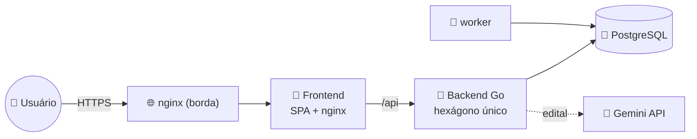

# 🐹 studygo


**Plano de estudos para concursos públicos.** Você cadastra o concurso (ou manda
o PDF do edital e a IA preenche), e o app monta um cronograma dia-a-dia que
divide o tempo entre as disciplinas pelo **peso de cada uma na prova**, com
revisão espaçada, reta final, simulados e um caderno de erros.

Nasceu do artefato [`claude.ai/code/artifact/ffbfa732…`](https://claude.ai/code/artifact/ffbfa732-6b82-4525-a49d-15dcf7b83693)
— um planejador de arquivo único para o TCE-GO. O **design** e o **motor de
geração do plano** foram preservados na íntegra (o motor tem um _golden test_
contra a saída original); em volta deles cresceu um app multiusuário de verdade.

---

## O que ele faz

- **Cadastro de concurso** — manual (nome, data da prova, disciplinas com nº de
  questões) ou **a partir do edital**: envie o PDF e o Gemini extrai disciplinas,
  conteúdo programático, questões e o cronograma; você revisa antes de salvar.
- **Cronograma automático** — cada questão de conhecimentos específicos vale 2
  pontos, gerais vale 1; essa proporção define quantos dias cada disciplina
  recebe. Fases de **ciclo de conteúdo** (1ª passada no edital + revisão semanal)
  e **reta final** (revisão dirigida, discursiva, simulados).
- **Registro por matéria** — minutos estudados, questões, acertos, conclusão e
  anotação de **cada matéria**, não do dia inteiro: um dia pode estar meio feito, e a mesma
  disciplina agendada duas vezes no mesmo dia tem registros independentes. O dia
  conclui sozinho quando todas as suas matérias concluem.
- **Reorganizar o cronograma** — mova uma matéria para outro dia; se o destino já
  estiver ocupado as duas trocam de lugar. Só uma matéria já concluída não se
  move — isso reescreveria o que foi estudado. Terminou algo antes da hora? A
  matéria vem para o dia de hoje e o buraco se fecha sozinho.
- **Balanceamento** — quanto do seu tempo foi para cada disciplina _vs_ o ideal.
- **Estatísticas** — série de horas/acertos, streak de dias, evolução por
  disciplina.
- **Caderno de erros** — anotações livres + os dias com aproveitamento baixo, e
  um **dossiê pronto para o NotebookLM** por disciplina (ementa + leis + suas
  anotações).
- **Datas do edital** — cronograma oficial com checklist e alertas de prazo.
- **Legislação interativa** — a lei seca do edital, capturada da fonte oficial
  (Planalto, Casa Civil de Goiás) sem que a IA toque no texto, organizada em
  artigos, incisos e alíneas com link direto para cada dispositivo. Clique no
  artigo e resolva as questões (estilo da banca) que o citam; o gabarito vem
  com o trecho da lei grifado, e cada artigo mostra quanto você acertou.
- **Lembretes de revisão espaçada** — um worker calcula os temas de D-1/D-7/D-30
  que vencem no dia (hoje só loga; e-mail fica atrás da mesma interface).
- **Multiusuário** — conta por e-mail/senha (argon2id + JWT), cada usuário com
  seus concursos e progresso isolados.

---

## 🧰 Stack

| | Tecnologia | Papel |
|---|---|---|
| 🐹 | **Go 1.27** | backend hexagonal (`domain / port / service / adapter`), `net/http` puro, sem framework. Motor do plano em `internal/domain/plano` |
| 🧡 | **SvelteKit 2 · Svelte 5** | frontend SPA (`adapter-static`, sem SSR), runes, tokens de design copiados do artefato |
| 🐘 | **PostgreSQL 18** | banco — `concurso → disciplinas → temas → marcos` e `plano → atividades → registros`, sem ORM |
| 📜 | **SQL à mão** | uma baseline de migration, runner próprio (embed + `schema_migrations` + advisory lock) |
| 🔐 | **argon2id + JWT** | hash de senha (PHC) e auth com refresh rotativo |
| 🤖 | **Gemini API** | importação opcional do concurso a partir do edital (`GEMINI_API_KEY`) |
| 🔔 | **worker** | `cmd/worker` — lembretes diários de revisão espaçada |
| 🐳 | **Docker Compose** | `postgres + backend + worker + frontend`, com **hot reload** no desenvolvimento |
| 🌐 | **nginx + Cloudflare Tunnel** | reverse proxy no servidor; HTTPS e acesso público pelo túnel, sem porta aberta |
| 📕 | **Ansible** | provisiona o servidor e promove as imagens que a pipeline construiu e testou |

---

## 📐 Arquitetura



Um hexágono só, sem bounded contexts — simples de propósito. O cronograma é
**materializado**: o motor propõe, o banco guarda, e cada bloco da tela é uma
linha com id próprio. As decisões estruturais estão em
**[docs/arquitetura.md](docs/arquitetura.md)**; as convenções para contribuir,
em **[CLAUDE.md](CLAUDE.md)**.

---

## 🚀 Começar

```bash
git clone <url-do-repo> && cd studygo
cp .env.example .env          # defina JWT_SECRET
make up                       # ou: docker compose up -d --build
open http://localhost:5173
```

`make` sozinho lista todos os atalhos — `make check` roda os testes dos três
serviços (rápido, sem Docker), `make check-db` a suíte de integração com
PostgreSQL efêmero, e a pipeline do GitLab publica (`docs/ci-cd.md`).

Salvou um arquivo, a mudança chega ao navegador (ou reinicia a API em ~5s) sem
rebuild — o `docker-compose.override.yml` é carregado sozinho pelo Compose e
aponta frontend e backend para os estágios `dev`. `--build` só quando mudar
dependência.

## 🛠️ Comandos (`make`)

Todo atalho do projeto é um alvo do `Makefile`. `make` sozinho lista os alvos
com a descrição de uma linha que fica no próprio Makefile — se esta tabela e
ele discordarem, vale o Makefile.

### Rodar na sua máquina

| Comando | O que faz |
|---|---|
| `make up` | sobe o app inteiro no Docker (banco, backend, worker, frontend e processador de editais) com hot reload: salvou o arquivo, a mudança aparece sem rebuild |
| `make down` | para o app local; os dados do banco continuam |
| `make restart` | reinicia todos os serviços, ou só um: `make restart svc=backend` |
| `make logs` | acompanha os logs ao vivo; `svc=backend` para ver um serviço só |
| `make ps` | mostra quais containers estão rodando |
| `make rebuild` | reconstrói as imagens e sobe; use quando mudar uma dependência (go.mod, package.json, pyproject) |
| `make reset` | ⚠️ derruba tudo **apagando o banco local** e sobe de novo, vazio |
| `make prod-local` | sobe as imagens de produção na sua máquina, sem hot reload — para ver o app como ele roda no servidor |

### Conferir antes de commitar

| Comando | O que faz |
|---|---|
| `make check` | roda as três verificações abaixo; é o que a pipeline roda. Não precisa de Docker |
| `make check-backend` | Go: compila, `go vet` e os testes |
| `make check-frontend` | frontend: `svelte-check` (tipos) e os testes do vitest |
| `make check-processor` | processador de editais: ruff, mypy estrito e pytest |
| `make check-db` | testes que precisam de PostgreSQL de verdade (migrations, repositórios); sobe um banco descartável por teste e nunca toca o seu. Exige Docker |
| `make e2e` | o app inteiro pelo navegador (Playwright), num stack isolado e com banco vazio. Cada teste cobre um item de `e2e/CENARIOS.md`, e o relatório com um print por cenário fica em `e2e/relatorio/`. Exige Docker; `MANTER=1 make e2e` deixa o stack de pé para investigar |
| `make fmt` | formata o código Go (gofmt) e o Python (ruff format) |
| `make lint` | lint do backend com o golangci-lint (fora do `check` de propósito) |
| `make cobertura` | cobertura dos testes do backend, incluindo os de integração. Exige Docker |
| `make seguranca` | procura vulnerabilidades conhecidas nas dependências dos três serviços (govulncheck, npm audit, pip-audit); depende da rede |

A legislação não tem comando: a lei é capturada pela tela (**Legislação →
Adicionar lei**) e as questões entram pela página dela (**Manter esta lei**).

### Git e publicação

| Comando | O que faz |
|---|---|
| `make status` | `git status` resumido |
| `make commit m="tipo(escopo): mensagem"` | roda o `make check` e, passando, commita **só o que você já pôs no stage** (não faz `git add` sozinho) |
| `make push` | envia o branch ao GitLab — o que dispara a pipeline e, na `main`, o deploy no servidor — e ao espelho do GitHub |
| `make deploy` | não implanta nada: explica que o deploy é só pela pipeline e sai com erro |

### Servidor

O servidor é a distro `ubuntu-server` do WSL desta máquina, publicada por um
túnel da Cloudflare ([docs/deploy.md](docs/deploy.md),
[docs/cloudflare-tunnel.md](docs/cloudflare-tunnel.md)). Um ambiente só; a
aplicação chega lá só pela pipeline.

| Comando | O que faz |
|---|---|
| `make servidor-ligar` | liga o servidor (a distro, se estiver parada, e o app, o nginx e o túnel), espera o app responder e mostra o endereço público novo |
| `make servidor-desligar` | para o app, o Docker, o nginx e o túnel do servidor; a distro fica ociosa. O app sai do ar e a esteira não implanta até ligar de novo |
| `make servidor-endereco` | mostra o endereço público atual (`*.trycloudflare.com`), que muda a cada reinício do túnel |
| `make servidor-health` | consulta o `/health` no servidor e pelo endereço público: responde? que versão e que schema estão no ar? |
| `make servidor-status` | lista os containers da aplicação no servidor (o Docker rootless do usuário `studygo`) |
| `make servidor-logs svc=backend` | últimas linhas de log de um serviço no servidor; sem `svc`, de todos |
| `make provision` | reaplica a infraestrutura do servidor com o Ansible (Docker rootless, nginx, túnel); `tags=nginx` para uma parte só. Nunca publica a aplicação |

## 📚 Documentação

| | Documento | Para quê |
|---|---|---|
| 🐣 | **[docs/como-funciona.md](docs/como-funciona.md)** | **comece por aqui** — o projeto explicado sem jargão |
| 📐 | **[docs/arquitetura.md](docs/arquitetura.md)** | camadas, modelo de dados, contrato HTTP e vocabulário |
| 🔄 | **[docs/fluxo-de-trabalho.md](docs/fluxo-de-trabalho.md)** | o caminho de uma mudança: `check` → `commit` → `push` |
| 🚀 | **[docs/rodar-local.md](docs/rodar-local.md)** | rodar localmente, `.env`, hot-reload, checagens |
| 🚢 | **[docs/deploy.md](docs/deploy.md)** | o servidor no WSL: montar do zero e manter (Ansible) |
| ☁️ | **[docs/cloudflare-tunnel.md](docs/cloudflare-tunnel.md)** | o túnel da Cloudflare: como foi montado, endereço fixo, problemas |
| 🔁 | **[docs/ci-cd.md](docs/ci-cd.md)** | a esteira: publicar, promover por digest e voltar atrás |
| 🤖 | **[CLAUDE.md](CLAUDE.md)** | convenções para contribuir (e para a IA seguir) |
