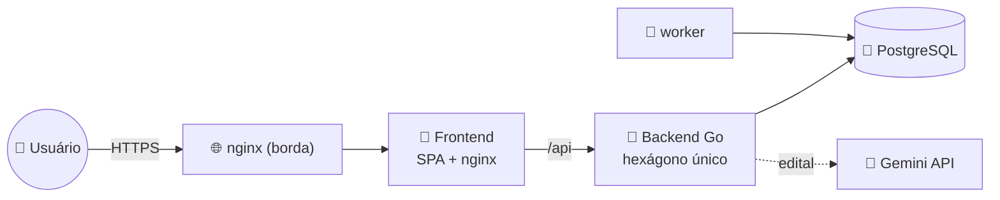

# 🐹 studygo


**Plano de estudos para concursos públicos.** Você cadastra o concurso (ou manda
o PDF do edital e a IA preenche), e o app monta um cronograma dia-a-dia que
divide o tempo entre as disciplinas pelo **peso de cada uma na prova**, com
revisão espaçada, reta final, simulados e um caderno de erros.

Nasceu do artefato [`claude.ai/code/artifact/ffbfa732…`](https://claude.ai/code/artifact/ffbfa732-6b82-4525-a49d-15dcf7b83693)
— um planejador de arquivo único para o TCE-GO. O **design** e o **motor de
geração do plano** foram preservados na íntegra (o motor tem um _golden test_
contra a saída original); em volta deles cresceu um app multiusuário de verdade.

---

## O que ele faz

- **Cadastro de concurso** — manual (nome, data da prova, disciplinas com nº de
  questões) ou **a partir do edital**: envie o PDF e o Gemini extrai disciplinas,
  conteúdo programático, questões e o cronograma; você revisa antes de salvar.
- **Cronograma automático** — cada questão de conhecimentos específicos vale 2
  pontos, gerais vale 1; essa proporção define quantos dias cada disciplina
  recebe. Fases de **ciclo de conteúdo** (1ª passada no edital + revisão semanal)
  e **reta final** (revisão dirigida, discursiva, simulados).
- **Registro por matéria** — horas, questões, acertos, conclusão e anotação de
  **cada matéria**, não do dia inteiro: um dia pode estar meio feito, e a mesma
  disciplina agendada duas vezes no mesmo dia tem registros independentes. O dia
  conclui sozinho quando todas as suas matérias concluem.
- **Reorganizar o cronograma** — mova uma matéria para outro dia; se o destino já
  estiver ocupado as duas trocam de lugar. Só uma matéria já concluída não se
  move — isso reescreveria o que foi estudado. Terminou algo antes da hora? A
  matéria vem para o dia de hoje e o buraco se fecha sozinho.
- **Balanceamento** — quanto do seu tempo foi para cada disciplina _vs_ o ideal.
- **Estatísticas** — série de horas/acertos, streak de dias, evolução por
  disciplina.
- **Caderno de erros** — anotações livres + os dias com aproveitamento baixo, e
  um **dossiê pronto para o NotebookLM** por disciplina (ementa + leis + suas
  anotações).
- **Datas do edital** — cronograma oficial com checklist e alertas de prazo.
- **Lembretes de revisão espaçada** — um worker calcula os temas de D-1/D-7/D-30
  que vencem no dia (hoje só loga; e-mail fica atrás da mesma interface).
- **Multiusuário** — conta por e-mail/senha (argon2id + JWT), cada usuário com
  seus concursos e progresso isolados.

---

## 🧰 Stack

| | Tecnologia | Papel |
|---|---|---|
| 🐹 | **Go 1.27** | backend hexagonal (`domain / port / service / adapter`), `net/http` puro, sem framework. Motor do plano em `internal/domain/plano` |
| 🧡 | **SvelteKit 2 · Svelte 5** | frontend SPA (`adapter-static`, sem SSR), runes, tokens de design copiados do artefato |
| 🐘 | **PostgreSQL 18** | banco — `concurso → disciplinas → temas → marcos` e `plano → atividades → registros`, sem ORM |
| 📜 | **SQL à mão** | uma baseline de migration, runner próprio (embed + `schema_migrations` + advisory lock) |
| 🔐 | **argon2id + JWT** | hash de senha (PHC) e auth com refresh rotativo |
| 🤖 | **Gemini API** | importação opcional do concurso a partir do edital (`GEMINI_API_KEY`) |
| 🔔 | **worker** | `cmd/worker` — lembretes diários de revisão espaçada |
| 🐳 | **Docker Compose** | `postgres + backend + worker + frontend`, com **hot reload** no desenvolvimento |
| 🌐 | **nginx + Let's Encrypt** | reverse proxy de borda + HTTPS na VPS |
| 📕 | **Ansible** | provisiona a VPS e faz o deploy (imagens buildadas localmente e enviadas prontas) |

---

## 📐 Arquitetura



Um hexágono só, sem bounded contexts — simples de propósito. O cronograma é
**materializado**: o motor propõe, o banco guarda, e cada bloco da tela é uma
linha com id próprio. As decisões estruturais estão em
**[docs/arquitetura.md](docs/arquitetura.md)**; as convenções para contribuir,
em **[CLAUDE.md](CLAUDE.md)**.

---

## 🚀 Começar

```bash
git clone <url-do-repo> && cd studygo
cp .env.example .env          # defina JWT_SECRET
make up                       # ou: docker compose up -d --build
open http://localhost:5173
```

`make` sozinho lista todos os atalhos — `make check` roda os testes dos três
serviços (rápido, sem Docker), `make check-db` a suíte de integração com
PostgreSQL efêmero, e `make deploy` publica.

Salvou um arquivo, a mudança chega ao navegador (ou reinicia a API em ~5s) sem
rebuild — o `docker-compose.override.yml` é carregado sozinho pelo Compose e
aponta frontend e backend para os estágios `dev`. `--build` só quando mudar
dependência.

## 📚 Documentação

| | Documento | Para quê |
|---|---|---|
| 📐 | **[docs/arquitetura.md](docs/arquitetura.md)** | camadas, modelo de dados, contrato HTTP e vocabulário |
| 🔄 | **[docs/fluxo-de-trabalho.md](docs/fluxo-de-trabalho.md)** | o caminho de uma mudança: `check` → `commit` → `deploy` |
| 🚀 | **[docs/rodar-local.md](docs/rodar-local.md)** | rodar localmente, `.env`, hot-reload, checagens |
| 🚢 | **[docs/deploy.md](docs/deploy.md)** | provisionar a VPS pela primeira vez (Ansible) |
| 🔍 | **[docs/auditoria-testes.md](docs/auditoria-testes.md)** | por que a suíte de testes é como é |
| 🤖 | **[CLAUDE.md](CLAUDE.md)** | convenções para contribuir (e para a IA seguir) |
