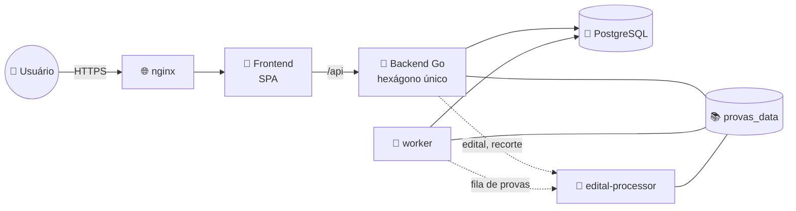
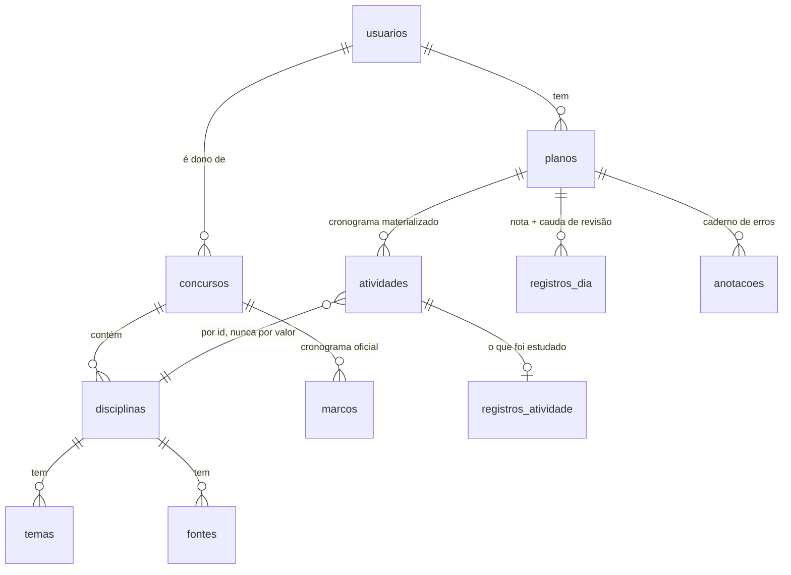

# 📐 Arquitetura


> **Documento técnico.** Se você quer entender o projeto pela primeira vez,
> comece por [como-funciona.md](como-funciona.md), que explica a mesma coisa
> sem jargão. Este aqui é a referência detalhada das decisões e do modelo de
> dados.
Este documento descreve o produto **como ele é hoje**: as decisões estruturais
que valem, o modelo de dados e o vocabulário. Ele não conta a história de como se
chegou aqui — quando uma decisão substituiu outra, o motivo está registrado
porque ele ainda restringe o que pode mudar.

---

## 🗺️ Visão geral



Um hexágono só no backend, sem bounded contexts. Os domínios do produto —
concurso, plano, usuário — compartilham um único modelo de dados e são sempre
lidos juntos; separá-los criaria fronteiras que só custariam tradução.

---

## 🧱 Camadas

| | Camada | Responsabilidade |
|---|---|---|
| 🚀 | `cmd/` | composição e inicialização |
| 🔌 | `adapter/httpapi/` | HTTP, auth, DTOs (tags JSON), mappers, redação das mensagens |
| 🐘 | `adapter/postgres/` | repositories e SQL |
| 🐍 | `adapter/editalproc/` | cliente do edital-processor (editais) |
| 📚 | `adapter/provaproc/` | cliente das rotas de provas do edital-processor |
| 🗃️ | `adapter/provafiles/` | PDFs das provas no volume `provas_data` |
| 🔐 | `adapter/crypto/` | argon2id, JWT |
| 🔔 | `adapter/notifier/` | entrega de lembretes |
| ⚙️ | `service/` | casos de uso |
| 🔗 | `port/` | contratos de que os casos de uso precisam |
| 💎 | `domain/` | regras de negócio puras |
| 🛠️ | `platform/` | config, pool, HTTP server, middleware |

As dependências apontam para dentro. O domínio não importa nada das camadas de
fora — nem `net/http`, nem `encoding/json`, nem `pgx`.

**Não existe camada de "modelo de persistência".** Os repositories escaneiam
direto para as entidades de domínio. Nesta escala, structs espelho seriam
cerimônia sem responsabilidade: o isolamento que importa já é alcançado sem
elas.

---

## ⭐ A decisão central: o cronograma é materializado

`plano.Gerar` é um planejador **puro** — dada a configuração e o catálogo, ele
devolve uma proposta de cronograma. Essa proposta é **gravada uma vez**, na
criação do plano, e a tabela `atividades` passa a ser o cronograma de verdade.

> [!IMPORTANT]
> Toda atividade de todo dia existe como linha, com id próprio, desde o começo.

Isso é o que permite:

- o registro de estudo ter chave estrangeira de verdade para a atividade;
- a tela endereçar qualquer bloco sem inventar identificador;
- `GET /plano` ser leitura pura, sem escrever nada;
- duas ocorrências da mesma matéria num dia serem independentes de fato.

O modelo anterior gerava o plano a cada requisição e guardava só *sobreposições*,
materializadas preguiçosamente. Dele vinham ids sintéticos, reconciliação a cada
leitura, deduplicação corretiva e escrita no meio de um GET — e daí vinha a
maioria dos bugs de cronograma.

**Replanejamento.** Quando a configuração muda o que o motor distribui (blocos
por dia, duração, datas, questões), `plano.Replanejar` regera os dias à frente
preservando três coisas: o que já passou, o que está concluído e o que o
estudante moveu à mão (`Atividade.Movida`). Um dia que teve qualquer atividade
preservada fica inteiro como está — do contrário ele receberia também a leva
recém-gerada e passaria a mostrar a mesma matéria duas vezes.

**Antecipação.** Concluir uma matéria agendada para a frente traz ela para o dia
de hoje e fecha o buraco que ela deixa — automaticamente, dentro de
`RegistroService.Registrar`. É por isso que a tela não tem botão de "adiantar":
concluir já diz "terminei isto hoje", e um botão à parte pediria a mesma
informação duas vezes.

A operação em si continua existindo (`CronogramaService.Antecipar`,
`POST …/atividades/antecipar`) porque ela **não** é um caso particular de mover:
mover anda uma vaga por vez, para um dia vizinho; antecipar salta de qualquer
dia futuro direto para hoje e fecha o buraco de uma vez.

---

## 🗄️ Modelo de dados



<details>
<summary>Em árvore, se preferir</summary>

```
usuarios ──┬── refresh_tokens
           ├── concursos ──┬── disciplinas ──┬── temas
           │               │                 └── fontes
           │               ├── marcos
           │               └── conteudo_programatico
           └── planos ─────┬── plano_disciplinas ──► disciplinas
                           ├── marco_checks ──► marcos
                           ├── anotacoes ──► disciplinas
                           ├── registros_dia
                           └── atividades ──┬──► disciplinas
                                            └── registros_atividade
```

</details>

Regras que o schema carrega:

- **Identidade por id, nunca por valor.** `atividades.disciplina_id` e
  `plano_disciplinas.disciplina_id` são FKs de verdade. O `codigo` da disciplina
  é o mnemônico exibido ("DIRAD"), único no concurso — mas quem identifica é a
  chave primária. Editar o concurso preserva os ids, e por isso renomear uma
  matéria não desliga o cronograma nem o histórico dela. É essa separação que
  deixa o usuário escolher a própria tag ("RLM" no lugar de "MATRA") sem
  consequência nenhuma: o formulário devolve `id` e `codigo`, e trocar o rótulo
  não move FK alguma.
- **O registro é história.** `registros_atividade.atividade_id` é NOT NULL, UNIQUE
  e **ON DELETE RESTRICT**: uma atividade já estudada não pode simplesmente sumir
  do cronograma.
- **A conclusão do dia não tem coluna.** Ela é derivada das atividades daquele
  dia (`plano.DiaConcluido`): o dia termina quando todas terminam.
- `registros_dia` guarda só o que pertence ao dia e não a uma atividade — a
  anotação livre e o resultado da cauda de revisão, que o motor deriva da fila e
  por isso não é uma atividade endereçável.
- `usuarios.tema_ui` é do usuário, não do plano: quem estuda para dois concursos
  não quer dois temas.
- A UNIQUE `(plano_id, data, posicao)` é DEFERRABLE porque mover uma matéria
  renumera o dia inteiro dentro de uma transação, passando por estados
  intermediários que colidiriam.

### O dia vira em Brasília

O cronograma é feito de **datas**, não de instantes: "o que estudo hoje" tem que
responder o mesmo às 8h e às 22h da mesma terça. Por isso `port.Fuso` fixa
America/São Paulo, e é dele que sai todo `Now()` que o domínio consome —
`plano.DayOf` extrai o dia já no fuso certo.

Com o relógio em UTC o dia virava às 21:00 locais: quem estudasse à noite via o
cronograma de amanhã, e quem estudasse de madrugada tinha o dia anterior dado
como perdido pelo replanejamento.

O fuso é fixo e não configurável. Um valor por instalação seria mentira assim
que dois usuários estivessem em fusos diferentes — a resposta certa para isso é
o fuso viajar com o usuário, o que é mudança de modelo, não de variável.
Registro de auditoria (`atualizado_em`) continua em `timestamptz` gerado pelo
banco, e o JWT usa relógio próprio: nenhum dos dois passa por aqui.

---

## 📚 Catálogo de provas

Um catálogo **compartilhado**, fora dos concursos de cada usuário: provas
anteriores da FCC (múltipla escolha), com as questões transcritas, as figuras
recortadas do PDF original e o gabarito oficial. Quem publica são os curadores
— uma lista de UUIDs em `PROVAS_CURADORES`, sem sistema de papéis (no
ambiente local, `*` libera qualquer conta); todo mundo autenticado consulta.

```
provas_importacoes ──┬── provas_etapas                (resultado e duração de cada etapa)
      │              └── provas_importacao_arquivos ──► provas_arquivos
      └──► provas ──┬── provas_revisoes ──┬── provas_questoes ──► provas_questoes_conteudo
                    │                     ├── provas_apoios ───► provas_apoios_conteudo
                    │                     └── provas_gabaritos ── provas_gabarito_respostas
                    └── provas_anotacoes  (a nota de cada estudante, por questão)
```

**Importação é trabalho de curadoria; publicação é o que o catálogo mostra.** A
importação guarda o rascunho revisável (jsonb, com os nomes dos campos de
`prova.Rascunho`); publicar abre uma revisão imutável da prova e grava uma
linha por questão, que é o que garante número único e o que a busca por
disciplina filtra. Uma revisão nova de prova já publicada é outra importação,
que herda os arquivos; a publicada fica no ar até a próxima.

**Cada questão é guardada uma vez só.** A questão se divide no que ela é em
qualquer prova — texto, alternativas, figuras (`ConteudoDeQuestao`) — e no
lugar que ocupa numa prova — número, matéria, assunto, onde está no PDF
(`LugarDaQuestao`). O conteúdo vai para `provas_questoes_conteudo`,
identificado pela impressão (`Impressao`, que ignora espaços): a revisão nova
que repete a anterior e o cargo que repete as Conhecimentos Gerais de outro
apontam para a mesma linha. O texto de apoio segue o mesmo caminho. A revisão
guarda só a identificação; publicada, a importação fica com a identificação, e
o resultado bruto das etapas sai.

**O gabarito é uma entidade à parte da questão.** A questão é o que o caderno
diz; a resposta é o que o gabarito diz — outro documento da banca. Publicado,
o gabarito vai para `provas_gabaritos` (cargo, tipo do caderno, preliminar ou
definitivo) e `provas_gabarito_respostas` (uma linha por número, com a letra —
vazia na anulada, e o banco só aceita A a E — e a situação); nem a questão
publicada nem a revisão guardam a resposta, e a leitura a traz do gabarito.
Um gabarito por revisão, sem histórico: o que muda entra numa revisão nova. No
rascunho da importação, que o curador edita, a resposta ainda anda junto de
cada questão, e a publicação exige que as duas batam. As provas publicadas em
staging antes da 000007 guardavam a resposta na questão e ficam sem ela: abrir
revisão, trocar o gabarito e publicar de novo.

**O mesmo concurso aproveita o que já foi publicado.** Na consolidação — e no
botão "Procurar questões já cadastradas" da revisão —, cada questão é comparada
com as das provas publicadas da mesma banca, ano e órgão (`MesmoOrgao`: "TRF 1"
é "TRF1"). É a mesma questão quando cada alternativa, na mesma letra, bate por
letras (o OCR troca "Sêneca" por "Sâneca") e o enunciado de uma contém o da
outra; com cinco alternativas de texto quase idênticas, o enunciado pode ter
perdido um trecho na leitura. A leitura que perdeu alternativas também é a
mesma, com o mesmo número, quando o enunciado bate e cada alternativa lida bate
na mesma letra (`mesmaQuestaoIncompleta`) — sem nenhuma lida, não: é a ordem
delas que diz se a resposta do gabarito desta prova vale para o conteúdo de lá.
Com outro número, só a quase idêntica. A questão
igual vira referência à já cadastrada (`Rascunho.Reaproveitar`): o conteúdo é o
de lá, que o curador revisou, a resposta é a do gabarito desta prova, ela entra
conferida e não aparece na revisão — um aviso lista as reaproveitadas. Uma
linha só no banco; editar a reaproveitada cria uma versão só desta prova.

**A fila é o PostgreSQL.** O worker roda a extração num laço próprio, uma etapa
por vez, uma importação por vez no ambiente inteiro:

| Etapa | O que faz | Chama o Gemini |
|---|---|---|
| preparar | divide cada página em regiões com sobreposição, sem renderizar a página inteira | não |
| metadados | órgão, ano, cargo, caderno e total, lidos só da capa | sim |
| gabarito | leitura determinística do texto — o gabarito de um tipo (número, letra e situação linha a linha, ou a tabela Questão/Alternativa sem situação), ou a relação do site da FCC com todos, de onde sai o tipo do caderno lido na capa; Gemini só se o PDF não tiver texto | às vezes |
| uma por região | questões, textos de apoio e retângulos das figuras | sim |
| consolidação | aplica o gabarito, ordena e classifica por matéria as questões de seção genérica | sim, só texto |

Cada etapa é reservada por uma tentativa (`tentativa`, `reserva_ate`),
renovada enquanto roda; o resultado só grava se a tentativa ainda detiver a
reserva — um worker que travou, ou uma importação cancelada no meio, não
sobrescreve nada. Falha transitória volta à fila com espera que dobra (15 s a
4 min, seis tentativas por etapa: `prova.EsperaParaRepetir`); recusa do
documento para. Sobrecarga do Gemini (503) e cota (429) já passam ao próximo
modelo da cadeia dentro da mesma chamada. Há teto de chamadas e de tempo por
importação.

As regiões se sobrepõem, então a mesma questão chega duas vezes:
`Rascunho.Mesclar` prefere a versão completa, junta fragmentos e **avisa**
quando duas leituras completas divergem. A sobreposição não basta para questão
alta ou que começa rente à borda — uma região a vê sem o fim, a seguinte a vê
sem o número e a pula. Por isso, depois da última região, cada questão que
ficou sem as cinco alternativas ganha uma **releitura**: uma região a mais,
centrada na borda que a cortou (o retângulo que o modelo dá para a questão erra
por dezenas de pontos; a borda é exata) ou, quando a questão faltou ou veio
vazia, entre as vizinhas lidas — passando do topo ou do pé da página, na página
vizinha; recortes que se repetiriam viram um só. A releitura tem a medida da
própria página: um PDF escaneado pode ter a capa com o dobro do tamanho das
outras. Da releitura só entra o que estava incompleto
(`Rascunho.AplicarReleitura`), e a releitura que o processador recusa vira
alerta, sem derrubar a importação. O processador não confia na estimativa: com
o número da questão (`QuestaoDaReleitura`), o OCR acha "42." na região, na
página dela e nas vizinhas, e lê só a questão, do número até a seguinte
(`localizar_questao`) — a posição que o modelo dá para as vizinhas chegou a
errar a página. Na revisão, "Reler" faz o mesmo sob demanda,
e o filtro "Com problema" mostra as questões com defeito. Quando nem isso
acerta, o curador marca no original o **trecho** que ficou errado ("Ler de
novo", no painel ao lado da questão) — ela inteira, só o enunciado ou só as
alternativas que faltaram: a etapa `EtapaTrecho` lê só aquele retângulo, como
está, sem procurar a questão pelo número, e volta direto à revisão, sem
consolidar de novo. O que o trecho trouxe entra sem comparar com a leitura
antiga — quem apontou onde está foi o curador —: o enunciado, se veio, e cada
alternativa pela letra; o resto da questão, a matéria, a resposta e os textos
ligados ficam (`Rascunho.AplicarTrecho`). O texto de apoio tem o mesmo "Ler de
novo" (trecho `ta:<id>`): o processador pede só o texto (`texto_de_apoio`) e, se
a IA não o transcreve — obra publicada, recitação —, usa o texto do PDF naquele
retângulo ou o OCR dele, com aviso para conferir; do texto ficam as questões
ligadas (`Rascunho.AplicarTrechoDeApoio`). Sem o número dentro do trecho, o
modelo chuta outro, e vale a única questão lida. O retângulo começa do alto da
questão até pouco depois do começo da seguinte (`trechoInicial`) — a área que a
extração deu é só o que ela leu, e na questão sem alternativas era o enunciado —,
e as bordas se esticam com o dedo. Arredondado na tela, o retângulo passava da
página por um centésimo e era recusado; agora ele volta para dentro da região,
e o processador aceita meio ponto além da borda. Se a questão continua sem as
cinco alternativas, um alerta diz para esticar até a (E). O trecho é a última
região da lista, rotulada `t<número>`. Quando o Gemini se
recusa a transcrever o texto de apoio (recitação de obra publicada), o
processador pede só a estrutura e transcreve o texto por OCR do retângulo, com
alerta para o curador. Recusada até a estrutura — as questões citam trechos do
texto —, o OCR transcreve os textos, e as linhas dele dizem onde cada um vai
do aviso à fonte: as faixas de fora, onde estão as questões, são lidas de novo
sem o texto (`faixas_de_questoes`).

**A matéria é da questão, não da seção.** O caderno põe quarenta questões sob
"Conhecimentos Específicos"; a consolidação manda o resumo de todas numa chamada
só, para a mesma matéria ter o mesmo nome na prova toda, e troca pela sugestão
só a seção genérica — título que já é matéria ("Língua Portuguesa") manda. Na
revisão, "Sugerir matérias" faz o mesmo sob demanda, sem gravar.

**O assunto é do curador.** Dentro da matéria, o assunto ("Crase", "Redes
TCP/IP e protocolos") é o que o treino filtra, e só junta questões se o nome
for o mesmo em todas as provas — por isso a extração não o preenche. O editor
sugere as matérias e os assuntos que o catálogo publicado já usa; a questão
reaproveitada de outra prova traz o assunto de lá (`Reaproveitar`); e mudar a
classificação não desfaz a conferência, porque não muda o que a questão diz.
Mora no `lugar` (jsonb) — o filtro roda no navegador, não no SQL.

**O curador edita texto, não blocos.** Cada campo (enunciado, alternativa,
texto de apoio) é um texto só, com marcação curta: `**negrito**`, `*itálico*`,
`__sublinhado__`, crases para `comando` no meio da frase, três crases em volta
de um bloco de código e `[figura 1]` onde a figura entra. O frontend converte
nos dois sentidos (`lib/provas/marcacao.ts`); o que se grava continua sendo a
lista de blocos — sem os vazios que a extração deixa, que o curador não
enxergaria (`Rascunho.LimparBlocos`; o espaço entre dois trechos formatados
fica). Código que a IA transcreveu como prosa — o SQL partido por uma
lacuna sublinhada, por exemplo — o processador junta num bloco de código, com a
lacuna escrita dentro (`___I___`). Figuras guardam o tamanho na tela
(`Largura`, % da coluna), que é apresentação: mudar não desfaz conferência.

**Figura nunca vem da IA.** O Gemini aponta o retângulo; o processador recorta
o PDF original. Antes, ajusta o retângulo aos pixels (`ajustar_figura`): o
trecho vira faixas de tinta, o núcleo é a maior faixa dentro da caixa, e a
figura cresce com título e rótulos até esbarrar em prosa — faixa que passa da
figura pelos dois lados. Vale para PDF de texto e escaneado. O tamanho na tela
(`Largura`) é a proporção que a figura tem no caderno em relação à questão
(`DimensionarFiguras`): o recorte sai com até 2,8 vezes a resolução do PDF, e no
tamanho do arquivo um diagrama pequeno ocupava a coluna inteira. O curador ajusta o retângulo na tela, e o recorte tem id
derivado do documento e das coordenadas — pedir o mesmo recorte de novo não
grava outro arquivo.

**O cargo tem código e nome.** O código ("F06", de "Caderno de Prova 'F06'",
na capa e no alto das páginas; em alguns concursos só número, como "24") é o
que o gabarito cita e o que o confere; o
nome por extenso (`CargoNome`) é o que o aluno lê e busca. A leitura da capa às
vezes devolve o nome no lugar do código: o processador o passa para o nome
(`acertar_cargo`) e tira o código do quadro do candidato — do texto do PDF ou,
na capa escaneada, do OCR dela, que perdoa as trocas típicas ("Cademo de Prova
'FO6, Tipo" é F06). Sem código mesmo assim, a pendência diz onde achá-lo, com
um botão na revisão que usa o do gabarito.

**Capa que não diz o total não trava a prova.** Caderno sem capa, ou com capa
noutro formato (o do MPEAL), chegava com total 0, e cada questão virava uma
pendência de numeração. O total vem então da numeração do gabarito do cargo
(`TotalPeloGabarito`, com alerta para conferir), e as pendências nomeiam o
campo vazio e a etapa em que se preenche, em vez de pedir para conferir tudo.

**O curador confere só o que tem problema.** No fim da importação, a questão
inteira, com as cinco alternativas preenchidas, a resposta do gabarito, os
textos que cita ligados e nenhum alerta da extração falando dela já vem
conferida (`Rascunho.ConfirmarSemProblema`). Questão com figura, só depois que
o curador confere cada recorte — só olhando o original se sabe se pegou a
figura inteira; conferido o último, a questão fica conferida
(`ConfirmarPelosRecortes`). A revisão as destaca — filtro "Com figura", ponto
no mapa, aviso na questão.

**Vai ao catálogo o que está pronto; o resto fica de fora sem travar.**
`Rascunho.ParaPublicar` escolhe as questões conferidas (quando o ambiente
exige) e com linha no gabarito, inteiras, com as figuras recortadas e os textos
que usam conferidos. A que não atende fica de fora com o motivo (`DeFora`) — 56
conferidas publicam mesmo com 4 por transcrever — e o número dela entra nas
excluídas da revisão publicada, que reaberta deixa corrigir e publicar de novo.
`Pendencias` só impede publicar quando não sobra nenhuma; identificação que a
capa não deu e gabarito de outro cargo ou caderno são `Avisos`. O gabarito que
o banco recusa (letra fora de A–E, número com zero à esquerda) é acertado ou
descartado linha a linha. A resposta de uma questão só vem do gabarito
oficial, nunca da IA, e editar algo desfaz a conferência dele
(`InvalidarEdicoes`) — a tela avisa quais voltaram a pedir conferência. Trocar
o gabarito só desconfere a questão cuja letra mudou; a que ganha a resposta que
não tinha continua conferida (`AplicarGabarito`). O que foi alterado e não salvo fica numa cópia no navegador
(`rascunhoLocal.ts`), recuperada se o celular recarregar a aba; ela só vale
sobre a mesma versão salva. Qualquer questão pode sair da prova
(`Rascunho.Excluidas`) — a anulada, a estragada, a que a extração não achou e
não vale transcrever: deixa de ser esperada, `Total` continua o da capa, o
gabarito fica inteiro e o catálogo conta só as que ficaram (`QuestoesNaProva`).
Rascunho e revisão gravados antes guardam a chave antiga `AnuladasExcluidas`,
que a leitura do repositório ainda entende; e marcar o trecho da excluída a
devolve à prova. `PROVAS_EXIGIR_CONFERENCIA=false`
publica também a questão não conferida — para testar o fluxo antes de haver
quem revise —, mas a integridade continua valendo. A prova de pacote entra sem
pedir conferência nem gabarito: já foi publicada noutro ambiente.

**Resolver não grava nada.** A prova publicada abre uma questão por vez: o
nome da prova com as matérias em etiquetas que filtram, uma barra presa com a
navegação e o mapa das questões (cor por acerto, ponto onde há nota), e atalhos
de teclado (setas, A–E, Enter, N). A questão aberta vai no endereço (`?q=7`).
"Estudar" só aparece com anotação: anda só pelas questões anotadas e mostra só
a nota, sem repetir a questão. As respostas ficam no navegador
(`localStorage`, por prova); registrar o desempenho no servidor é outra
entrega, com tabela própria.

**O treino por matéria junta as questões de todas as provas.** A tela
Questões tem duas entradas: a prova inteira (`/provas/{id}`) e as questões de
uma ou mais matérias (`/questoes/resolver`). `GET /api/provas/questoes` lista as
questões publicadas sem o conteúdo — prova, número, matéria, assunto, resposta — uma vez
por conteúdo: a questão que caiu igual em dois cargos vem da prova que estreou
primeiro no catálogo (a primeira revisão, para republicar não trocar a
ocorrência e fazer a questão parecer nunca resolvida). Duas grafias da mesma
matéria ("Noções Sobre…" e "Noções sobre…") viram um nome só em
`prova.Avulsas`, e é por isso que o filtro por matéria roda no service, não no
SQL. O conteúdo vem da prova (`GET /api/provas/{id}`), carregada na vez da
questão. O filtro de situação — não resolvidas, as que errou — é do navegador,
porque as respostas também são; e o treino grava no mesmo lugar que a prova
inteira: resolvida num, aparece resolvida no outro. Com matéria escolhida,
aparecem os assuntos dela; o assunto restringe só a própria matéria —
Crase em Português não tira Redes do treino.

**A anotação é do estudante, por questão.** Markdown (título, lista, tarefa,
citação, código, link — só `http`, `https` e `mailto` viram link), salvo sozinho
enquanto se digita, visível só para quem escreveu. É guardada por prova e
número, não pela revisão: publicar uma revisão nova ou tirar a prova do catálogo
não a apaga. Gravar texto vazio apaga a nota (`ProvaService.Anotar`). Na
questão ainda não respondida, a nota fica fechada, a um clique — ela costuma
dizer qual é a resposta.

**O texto de apoio é só o texto.** No caderno da FCC ele vem como título da
seção, aviso ("Considere o texto … questões de 1 a 10"), texto e fonte. O
processador lê a faixa de questões no aviso — é ela que liga o texto às
questões das regiões seguintes — e depois tira do material o que vem antes do
texto e o começo de questão que o recorte pegue depois da fonte. O aviso não se
perde: fica em `Apoio.Aviso`, ao lado de onde o texto está no caderno
(`Apoio.Origens`), para o curador conferir a faixa. Quando o Gemini recusa a
região inteira e só o OCR a lê, os textos são achados pelo aviso e já chegam
ligados às questões que ele cita. Na revisão, os textos têm etapa própria, antes
das questões: ligar "1-10" põe o texto nas dez de uma vez, e texto sem questão é
pendência. Na tela do aluno, cada questão mostra o seu texto num recolhível
aberto; quem o fecha numa questão o encontra fechado nas outras que o usam.

**A prova vai de um ambiente a outro por pacote.** Para estrear o catálogo em
produção sem importar e revisar de novo, a curadoria exporta as provas publicadas
num .zip só (`GET /api/provas/pacotes`, ou `?prova=` para uma): um LEIA-ME e uma
pasta por prova, com `prova.json` (conteúdo da revisão em vigor, regiões, nomes e
o mapa das figuras), `prova.pdf`, `gabarito.pdf` e `figuras/questao-11-<uuid>.png`.
Tudo sem compressão: o navegador lê o .zip sem biblioteca (`lib/provas/pacote.ts`)
e importa uma prova por vez (`POST /api/provas/pacotes`, multipart com o
prova.json e os arquivos), porque o pacote inteiro passaria do limite de envio do
nginx. A prova entra publicada, sem fila nem conferência — já foi revisada lá —,
mas não com pendência de integridade, nem se já está no catálogo ou se o caderno
(pelo hash) já foi importado ali. As figuras mantêm o id, que é o que os blocos
citam; o PDF ganha id novo. O prova.json é contrato (`testdata/prova_pacote.json`,
`formatoDoPacote`).

**A prova importada duas vezes sai pela curadoria.** "Excluir prova" apaga de vez
a prova e tudo o que veio dela — revisões, questões, textos, gabarito, anotações e
as importações que a publicaram ou revisam (`ProvaRepo.ExcluirProva`, numa
transação); o conteúdo guardado uma vez para dois cargos fica na outra prova, e os
PDFs sem dono saem na limpeza do worker. Recusa enquanto uma importação dela
processa. "Tirar do catálogo" só esconde. "Editar título" troca o nome do cargo
da publicada sem revisão (`RenomearProva`); o código do cargo muda pela revisão,
porque confere o gabarito e acha a repetida.

**A mesma prova não entra duas vezes.** O hash é só o do caderno: reenviar o
mesmo PDF, com outro gabarito ou sem ele, acha a importação que já existe
(índice único no hash). Outro arquivo da mesma prova é pego pela capa: logo
depois dela, a importação com a mesma banca, órgão, ano e código do cargo de
uma prova publicada ou de outra importação ativa (`MesmaProva`; o tipo do
caderno não conta) para ali, sem ler gabarito nem questão — cancelada, com o
motivo, e segurando o hash (`Importacao.JaImportada`). A revisão de uma
publicada é ela mesma e não conta; e a publicação recusa a repetida que passou
pela capa sem código. A curadoria mostra, inteiro, o nome com que cada PDF foi
enviado (`nome_documento`, `nome_gabarito`; `prova.NomeDoArquivo`): é por ele
que o curador reconhece a prova quando a capa foi mal lida.

**Cancelar solta os PDFs; excluir apaga o rascunho.** Cancelada pelo curador,
a importação perde o hash (`Importacao.Cancelar`) e os mesmos arquivos podem
recomeçar do zero. Excluir
apaga a importação, com etapas e vínculos; a publicada é o histórico da prova e
não sai, e a que está processando precisa parar antes.

**Os arquivos moram no volume `provas_data`**, compartilhado por backend,
worker e processador, e não expiram. O banco registra quem referencia cada
arquivo: é isso que decide quem pode baixá-lo (curador vê rascunhos; os demais,
só o que pertence a uma prova visível) e o que a limpeza pode apagar. Rascunho
parado há 30 dias é cancelado; 30 dias depois, os arquivos que só ele usava
saem — e os de uma importação excluída, pelo mesmo caminho. O backup de cada deploy copia banco e volume sob o mesmo advisory lock da
limpeza.

---

## 📜 Migrations

A baseline é `000001_initial_schema`; as seguintes são numeradas em sequência.
Migrations criam **estrutura** — nada de backfill, função, trigger ou regra de
negócio. Isso não é convenção: `TestMigrations_NaoContemLogicaDeNegocio` falha
o build se aparecer.

O runner aplica só os `.up.sql`, em ordem, cada um numa transação, com advisory
lock (server e worker podem subir juntos). Os `.down.sql` existem para desfazer
à mão em desenvolvimento; o runner nunca os executa. Migration destrutiva
declara o `-- contract:` (ver [ci-cd.md](ci-cd.md)).

---

## ⚙️ Casos de uso

`PlanoService` foi dividido em serviços coesos, todos partindo das mesmas
`service.Dependencias`:

| | Serviço | Responsabilidade |
|---|---|---|
| 📋 | `PlanoService` | obter o plano montado, salvar configuração, marcos, link do caderno |
| 🗓️ | `CronogramaService` | mover, trocar, adiar, antecipar, compactar, restaurar ordem, absorver atraso |
| ✍️ | `RegistroService` | registrar atividade, registrar dia, limpar histórico |
| 📕 | `CadernoService` | caderno de erros e anotações |
| 📊 | `EstatisticaService` | série histórica, resumo por semana, balanceamento |
| 📄 | `DossieService` | documento de estudo para o NotebookLM |
| 📤 | `ExportacaoService` | CSV do plano |
| 📥 | `ImportacaoTECService` | planilha do TEC Concursos |
| 🏛️ | `ConcursoService` | catálogo e assistente de edital |
| 📚 | `ProvaService` | curadoria e consulta do catálogo de provas; fila de extração (worker) |
| 🔐 | `AuthService` | cadastro, login, rotação de token, tema |
| 🔔 | `NotificacaoService` | lembretes diários (worker) |

O worker roda duas tarefas na virada do dia, nesta ordem: `CronogramaService`
absorve os dias perdidos e `NotificacaoService` manda os lembretes — o lembrete
conta o que estudar hoje, e hoje só está certo depois do replanejamento. A fila
de provas corre ao lado, num laço próprio: uma extração de minutos não atrasa a
virada do dia, nem o contrário.

Nenhum deles tem interface: os handlers dependem do tipo concreto. Uma interface
com uma implementação só seria indireção sem ganho.

---

## 🔌 Contrato HTTP

Os DTOs vivem em `adapter/httpapi/dto_*.go` e são a **única** parte do sistema
com tag JSON. Os casos de uso devolvem tipos de aplicação sem tag; o adapter
traduz por agregado (`planoParaDTO` converte o plano inteiro), não struct a
struct.

O snapshot em `adapter/httpapi/testdata/` guarda a FORMA de cada payload — quais
chaves existem e de que tipo. Mudou o contrato, o teste falha:

```bash
ATUALIZAR_CONTRATO=1 go test ./internal/adapter/httpapi
```

Regrave e diga no commit qual campo mudou. `frontend/src/lib/types.ts` é o
espelho desses DTOs e muda junto.

### Sessão

Dois tokens, guardados em lugares diferentes de propósito:

| | Onde fica | Vida | Quem lê |
|---|---|---|---|
| access | memória do JavaScript | 15 min | o próprio app, no header `Authorization` |
| refresh | cookie `HttpOnly`, `SameSite=Strict`, `Path=/api/auth` | 30 dias | só o servidor |

Nada de sessão é gravado no `localStorage`. O refresh token é o que vale um
mês, e é justamente o que o JavaScript não alcança — um XSS consegue agir
enquanto a aba está aberta, não levar a conta embora.

Como o access token não sobrevive a um F5, **abrir o app começa por
`POST /api/auth/refresh`**: ele gira o cookie e devolve a conta junto, e só
depois dessa resposta o frontend decide entre a tela de login e o app
(`auth.pronto`, em `stores/auth.svelte.ts`).

Não há token de CSRF, e não falta: o cookie não viaja em requisição de outro
site (`SameSite=Strict`) e as rotas que mudam dados nem olham para ele — exigem
o header `Authorization`, que um formulário de terceiro não monta.

### Rotas

```
POST   /api/auth/{register,login,refresh,logout}   ← refresh e logout leem o cookie
GET    /api/me                          PUT /api/me/tema
GET    /api/concursos                   POST /api/concursos
GET    /api/concursos/{slug}            PUT|DELETE /api/concursos/{slug}
POST   /api/editais/{analisar,estrutura,conteudo}

GET|PUT   /api/concursos/{slug}/plano
PUT       …/plano/atividades/{id}/registro     ← o registro é por ATIVIDADE
PATCH     …/plano/dias/{data}                  ← nota do dia + cauda de revisão
DELETE    …/plano/registros
PUT       …/plano/marcos/{id}
PATCH     …/plano/disciplinas/{codigo}/links      ← caderno de erros + NotebookLM
POST      …/plano/atividades/{mover,antecipar}
POST      …/plano/dias/{data}/adiar
POST      …/plano/{compactar,restaurar-ordem}
GET       …/plano/{estatisticas,caderno,dossie,export.csv}
POST      …/plano/anotacoes    PATCH|DELETE …/plano/anotacoes/{id}
POST      …/plano/tec{,/preview}

GET       /api/provas                          ← catálogo (?ano, orgao, cargo, disciplina, offset)
GET       /api/provas/{id}                     ← ?numero= e ?disciplina= filtram as questões
GET       /api/provas/arquivos/{id}            ← PDF ou recorte
POST      /api/provas/{id}/{revisar,reextrair,excluir}                     ← curadoria
PATCH|DELETE /api/provas/{id}                     ← título; tirar do catálogo
GET|POST  /api/provas/pacotes                   ← levar a outro ambiente (.zip; uma prova por envio)
GET|POST  /api/provas/importacoes              GET|PATCH /api/provas/importacoes/{id}
POST      /api/provas/importacoes/{id}/{publicar,cancelar,reprocessar,excluir,reler,trecho,recortar,gabarito,materias}
GET       /api/provas/anotacoes/{id}           PUT /api/provas/anotacoes/{id}/{numero}   ← do estudante
```

Nenhuma rota de provas pode ter o `{id}` no terceiro segmento seguido de outro
segmento: `/api/provas/{id}/questoes` conflitaria com `/api/provas/arquivos/{id}`,
e o ServeMux entra em pânico ao registrar. `TestRouter_RotasDeProvasNaoConflitam`
monta o router inteiro para pegar isso.

---

## 🔤 Vocabulário

Conceitos de negócio em português, sem acento nos identificadores:

| Conceito | Go | Banco | JSON |
|---|---|---|---|
| Usuário | `usuario.Usuario` | `usuarios` | `usuario` |
| Concurso | `concurso.Concurso` | `concursos` | `concurso` |
| Disciplina | `concurso.Disciplina` | `disciplinas` | `disciplinas` |
| Plano | `plano.Plano` | `planos` | — |
| Atividade | `plano.Atividade` | `atividades` | `itens` |
| Registro | `plano.RegistroAtividade` | `registros_atividade` | campos da atividade |
| Anotação | `plano.Anotacao` | `anotacoes` | `anotacoes` |
| Prova | `prova.Publicacao` | `provas`, `provas_revisoes` | `prova` |
| Importação | `prova.Importacao` | `provas_importacoes` | `importacao` |
| Rascunho | `prova.Rascunho` | `provas_importacoes.rascunho` | `rascunho` |
| Questão | `prova.Questao` | `provas_questoes` (lugar) + `provas_questoes_conteudo` | `questoes` |
| Material de apoio | `prova.Apoio` | `provas_apoios` (lugar) + `provas_apoios_conteudo` | `apoios` |
| Anotação de questão | `prova.Anotacao` | `provas_anotacoes` | `anotacao` |

Termos técnicos universais ficam em inglês: HTTP, JSON, JWT, handler,
middleware, repository, adapter, service, port, worker, request, response,
token, hash, slug, upsert, batch.

Comentários e godoc em português.

---

## 🧪 Testes

| | Camada | O que cobre |
|---|---|---|
| 💎 | `domain/plano` | motor (golden test), cronograma, registros, replanejamento |
| 💎 | `domain/concurso` | sigla, slug, invariantes do cadastro |
| ⚙️ | `service` | orquestração, contra repositories em memória |
| 🔌 | `adapter/httpapi` | contrato HTTP (snapshot), auth, handlers do edital |
| 🐘 | `adapter/postgres` | repositories contra PostgreSQL efêmero (tag `integration`) |
| 📜 | `platform/db` | migrations em banco vazio, idempotência, advisory lock (tag `integration`) |
| 🔀 | `service` (fluxo) | services reais + repositories reais (tag `integration`) |
| 🧡 | `frontend` | as regras puras de `estudo.ts` |

### Duas suítes

| | Comando | O que roda | Docker? | Tempo |
|---|---|---|---|---|
| ⚡ | `make check` | domínio, aplicação (com fakes), contrato HTTP | não | < 1 s |
| 🐘 | `make check-db` | migrations, repositories e fluxos verticais | **sim** | ~4 s |

A separação é a build tag `integration`. Um teste que não precise de banco fica
FORA da tag — `TestMigrations_NaoContemLogicaDeNegocio`, por exemplo, só lê os
arquivos SQL embutidos e roda na suíte rápida.

> [!WARNING]
> A suíte de integração **falha** quando o Docker não está disponível, em vez de
> pular. Um `t.Skip` aqui produziria verde sem ter testado nada.

### PostgreSQL efêmero

`internal/platform/pgtest` sobe um container por PACOTE (Testcontainers,
`postgres:18-alpine` — a mesma imagem do Compose e da produção) e dá a **cada
teste um database exclusivo**, clonado por `CREATE DATABASE ... TEMPLATE` de um
modelo já migrado. Clonar custa milissegundos; migrar, centenas deles.

Isso é o que permite `t.Parallel()` sem `-p 1`: dois testes nunca disputam o
mesmo schema.

> [!CAUTION]
> O helper não lê `.env`, não aceita URL por variável de ambiente e não usa porta
> fixa. O harness anterior fazia as três coisas — e **apagou o banco de
> desenvolvimento de verdade**. Nenhum teste deve conseguir isso.

### Por que ainda existem fakes

Os dublês de `internal/service` cobrem ORQUESTRAÇÃO: o que a aplicação decide,
em que ordem chama as portas, como propaga erro. São rápidos e não precisam de
Docker.

Eles **não** reproduzem constraint, ordenação ou semântica relacional. Uma versão
anterior devolvia erros com nomes internos de constraint para fingir equivalência
com o banco — ilusão de cobertura: sem uma suíte de contrato rodando contra as
duas implementações, não há paridade a afirmar.

Quando um teste de aplicação precisa provocar falha de persistência, ele injeta
o erro do contrato da porta (`erroAoGravar`). PK, FK, UNIQUE, CHECK, RESTRICT,
transação, join, upsert e `ORDER BY` são verificados no PostgreSQL real.
