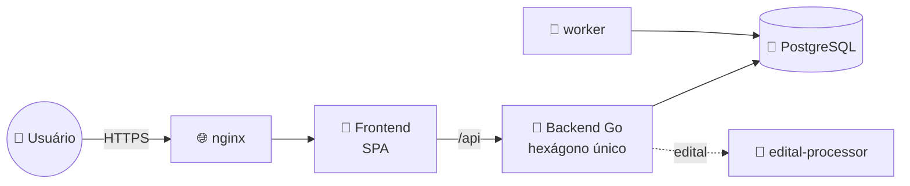
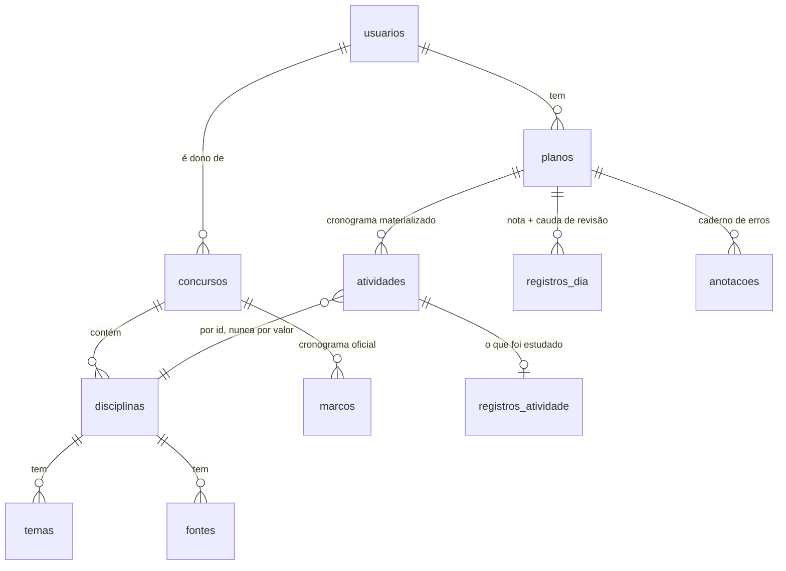

# 📐 Arquitetura


> **Documento técnico.** Se você quer entender o projeto pela primeira vez,
> comece por [como-funciona.md](como-funciona.md), que explica a mesma coisa
> sem jargão. Este aqui é a referência detalhada das decisões e do modelo de
> dados.
Este documento descreve o produto **como ele é hoje**: as decisões estruturais
que valem, o modelo de dados e o vocabulário. Ele não conta a história de como se
chegou aqui — quando uma decisão substituiu outra, o motivo está registrado
porque ele ainda restringe o que pode mudar.

---

## 🗺️ Visão geral



Um hexágono só no backend, sem bounded contexts. Os domínios do produto —
concurso, plano, usuário — compartilham um único modelo de dados e são sempre
lidos juntos; separá-los criaria fronteiras que só custariam tradução.

---

## 🧱 Camadas

| | Camada | Responsabilidade |
|---|---|---|
| 🚀 | `cmd/` | composição e inicialização |
| 🔌 | `adapter/httpapi/` | HTTP, auth, DTOs (tags JSON), mappers, redação das mensagens |
| 🐘 | `adapter/postgres/` | repositories e SQL |
| 🐍 | `adapter/editalproc/` | cliente do edital-processor |
| 🔐 | `adapter/crypto/` | argon2id, JWT |
| 🔔 | `adapter/notifier/` | entrega de lembretes |
| ⚙️ | `service/` | casos de uso |
| 🔗 | `port/` | contratos de que os casos de uso precisam |
| 💎 | `domain/` | regras de negócio puras |
| 🛠️ | `platform/` | config, pool, HTTP server, middleware |

As dependências apontam para dentro. O domínio não importa nada das camadas de
fora — nem `net/http`, nem `encoding/json`, nem `pgx`.

**Não existe camada de "modelo de persistência".** Os repositories escaneiam
direto para as entidades de domínio. Nesta escala, structs espelho seriam
cerimônia sem responsabilidade: o isolamento que importa já é alcançado sem
elas.

---

## ⭐ A decisão central: o cronograma é materializado

`plano.Gerar` é um planejador **puro** — dada a configuração e o catálogo, ele
devolve uma proposta de cronograma. Essa proposta é **gravada uma vez**, na
criação do plano, e a tabela `atividades` passa a ser o cronograma de verdade.

> [!IMPORTANT]
> Toda atividade de todo dia existe como linha, com id próprio, desde o começo.

Isso é o que permite:

- o registro de estudo ter chave estrangeira de verdade para a atividade;
- a tela endereçar qualquer bloco sem inventar identificador;
- `GET /plano` ser leitura pura, sem escrever nada;
- duas ocorrências da mesma matéria num dia serem independentes de fato.

O modelo anterior gerava o plano a cada requisição e guardava só *sobreposições*,
materializadas preguiçosamente. Dele vinham ids sintéticos, reconciliação a cada
leitura, deduplicação corretiva e escrita no meio de um GET — e daí vinha a
maioria dos bugs de cronograma.

**Replanejamento.** Quando a configuração muda o que o motor distribui (blocos
por dia, duração, datas, questões), `plano.Replanejar` regera os dias à frente
preservando três coisas: o que já passou, o que está concluído e o que o
estudante moveu à mão (`Atividade.Movida`). Um dia que teve qualquer atividade
preservada fica inteiro como está — do contrário ele receberia também a leva
recém-gerada e passaria a mostrar a mesma matéria duas vezes.

**Antecipação.** Concluir uma matéria agendada para a frente traz ela para o dia
de hoje e fecha o buraco que ela deixa — automaticamente, dentro de
`RegistroService.Registrar`. É por isso que a tela não tem botão de "adiantar":
concluir já diz "terminei isto hoje", e um botão à parte pediria a mesma
informação duas vezes.

A operação em si continua existindo (`CronogramaService.Antecipar`,
`POST …/atividades/antecipar`) porque ela **não** é um caso particular de mover:
mover anda uma vaga por vez, para um dia vizinho; antecipar salta de qualquer
dia futuro direto para hoje e fecha o buraco de uma vez.

---

## 🗄️ Modelo de dados



<details>
<summary>Em árvore, se preferir</summary>

```
usuarios ──┬── refresh_tokens
           ├── concursos ──┬── disciplinas ──┬── temas
           │               │                 └── fontes
           │               ├── marcos
           │               └── conteudo_programatico
           └── planos ─────┬── plano_disciplinas ──► disciplinas
                           ├── plano_ciclo
                           ├── marco_checks ──► marcos
                           ├── anotacoes ──► disciplinas
                           ├── registros_dia
                           └── atividades ──┬──► disciplinas
                                            └── registros_atividade
```

</details>

Regras que o schema carrega:

- **Identidade por id, nunca por valor.** `atividades.disciplina_id` e
  `plano_disciplinas.disciplina_id` são FKs de verdade. O `codigo` da disciplina
  é o mnemônico exibido ("DIRAD"), único no concurso — mas quem identifica é a
  chave primária. Editar o concurso preserva os ids, e por isso renomear uma
  matéria não desliga o cronograma nem o histórico dela.
- **O registro é história.** `registros_atividade.atividade_id` é NOT NULL, UNIQUE
  e **ON DELETE RESTRICT**: uma atividade já estudada não pode simplesmente sumir
  do cronograma.
- **A conclusão do dia não tem coluna.** Ela é derivada das atividades daquele
  dia (`plano.DiaConcluido`): o dia termina quando todas terminam.
- `registros_dia` guarda só o que pertence ao dia e não a uma atividade — a
  anotação livre e o resultado da cauda de revisão, que o motor deriva da fila e
  por isso não é uma atividade endereçável.
- `usuarios.tema_ui` é do usuário, não do plano: quem estuda para dois concursos
  não quer dois temas.
- A UNIQUE `(plano_id, data, posicao)` é DEFERRABLE porque mover uma matéria
  renumera o dia inteiro dentro de uma transação, passando por estados
  intermediários que colidiriam.

---

## 📜 Migrations

Uma baseline só: `000001_initial_schema`. Migrations criam **estrutura** —
nada de backfill, função, trigger ou regra de negócio. Isso não é convenção:
`TestMigrations_NaoContemLogicaDeNegocio` falha o build se aparecer.

O runner aplica só os `.up.sql`, em ordem, cada um numa transação, com advisory
lock (server e worker podem subir juntos). O `.down.sql` existe para desfazer a
baseline à mão em desenvolvimento; o runner nunca o executa.

---

## ⚙️ Casos de uso

`PlanoService` foi dividido em serviços coesos, todos partindo das mesmas
`service.Dependencias`:

| | Serviço | Responsabilidade |
|---|---|---|
| 📋 | `PlanoService` | obter o plano montado, salvar configuração, marcos, link do caderno |
| 🗓️ | `CronogramaService` | mover, trocar, adiar, antecipar, compactar, restaurar ordem |
| ✍️ | `RegistroService` | registrar atividade, registrar dia, limpar histórico |
| 📕 | `CadernoService` | caderno de erros e anotações |
| 📊 | `EstatisticaService` | série histórica, resumo por semana, balanceamento |
| 📄 | `DossieService` | documento de estudo para o NotebookLM |
| 📤 | `ExportacaoService` | CSV do plano |
| 📥 | `ImportacaoTECService` | planilha do TEC Concursos |
| 🏛️ | `ConcursoService` | catálogo e assistente de edital |
| 🔐 | `AuthService` | cadastro, login, rotação de token, tema |
| 🔔 | `NotificacaoService` | lembretes diários (worker) |

Nenhum deles tem interface: os handlers dependem do tipo concreto. Uma interface
com uma implementação só seria indireção sem ganho.

---

## 🔌 Contrato HTTP

Os DTOs vivem em `adapter/httpapi/dto_*.go` e são a **única** parte do sistema
com tag JSON. Os casos de uso devolvem tipos de aplicação sem tag; o adapter
traduz por agregado (`planoParaDTO` converte o plano inteiro), não struct a
struct.

O snapshot em `adapter/httpapi/testdata/` guarda a FORMA de cada payload — quais
chaves existem e de que tipo. Mudou o contrato, o teste falha:

```bash
ATUALIZAR_CONTRATO=1 go test ./internal/adapter/httpapi
```

Regrave e diga no commit qual campo mudou. `frontend/src/lib/types.ts` é o
espelho desses DTOs e muda junto.

### Rotas

```
POST   /api/auth/{register,login,refresh,logout}
GET    /api/me                          PUT /api/me/tema
GET    /api/concursos                   POST /api/concursos
GET    /api/concursos/{slug}            PUT|DELETE /api/concursos/{slug}
POST   /api/editais/{analisar,estrutura,conteudo}

GET|PUT   /api/concursos/{slug}/plano
PUT       …/plano/atividades/{id}/registro     ← o registro é por ATIVIDADE
PATCH     …/plano/dias/{data}                  ← nota do dia + cauda de revisão
DELETE    …/plano/registros
PUT       …/plano/marcos/{id}
PATCH     …/plano/disciplinas/{codigo}/caderno
POST      …/plano/atividades/{mover,antecipar}
POST      …/plano/dias/{data}/adiar
POST      …/plano/{compactar,restaurar-ordem}
GET       …/plano/{estatisticas,caderno,dossie,export.csv}
POST      …/plano/anotacoes    PATCH|DELETE …/plano/anotacoes/{id}
POST      …/plano/tec{,/preview}
```

---

## 🔤 Vocabulário

Conceitos de negócio em português, sem acento nos identificadores:

| Conceito | Go | Banco | JSON |
|---|---|---|---|
| Usuário | `usuario.Usuario` | `usuarios` | `usuario` |
| Concurso | `concurso.Concurso` | `concursos` | `concurso` |
| Disciplina | `concurso.Disciplina` | `disciplinas` | `disciplinas` |
| Plano | `plano.Plano` | `planos` | — |
| Atividade | `plano.Atividade` | `atividades` | `itens` |
| Registro | `plano.RegistroAtividade` | `registros_atividade` | campos da atividade |
| Anotação | `plano.Anotacao` | `anotacoes` | `anotacoes` |

Termos técnicos universais ficam em inglês: HTTP, JSON, JWT, handler,
middleware, repository, adapter, service, port, worker, request, response,
token, hash, slug, upsert, batch.

Comentários e godoc em português.

---

## 🧪 Testes

| | Camada | O que cobre |
|---|---|---|
| 💎 | `domain/plano` | motor (golden test), cronograma, registros, replanejamento |
| 💎 | `domain/concurso` | sigla, slug, invariantes do cadastro |
| ⚙️ | `service` | orquestração, contra repositories em memória |
| 🔌 | `adapter/httpapi` | contrato HTTP (snapshot), auth, handlers do edital |
| 🐘 | `adapter/postgres` | repositories contra PostgreSQL efêmero (tag `integration`) |
| 📜 | `platform/db` | migrations em banco vazio, idempotência, advisory lock (tag `integration`) |
| 🔀 | `service` (fluxo) | services reais + repositories reais (tag `integration`) |
| 🧡 | `frontend` | as regras puras de `estudo.ts` |

### Duas suítes

| | Comando | O que roda | Docker? | Tempo |
|---|---|---|---|---|
| ⚡ | `make check` | domínio, aplicação (com fakes), contrato HTTP | não | < 1 s |
| 🐘 | `make check-db` | migrations, repositories e fluxos verticais | **sim** | ~4 s |

A separação é a build tag `integration`. Um teste que não precise de banco fica
FORA da tag — `TestMigrations_NaoContemLogicaDeNegocio`, por exemplo, só lê os
arquivos SQL embutidos e roda na suíte rápida.

> [!WARNING]
> A suíte de integração **falha** quando o Docker não está disponível, em vez de
> pular. Um `t.Skip` aqui produziria verde sem ter testado nada.

### PostgreSQL efêmero

`internal/platform/pgtest` sobe um container por PACOTE (Testcontainers,
`postgres:18-alpine` — a mesma imagem do Compose e da produção) e dá a **cada
teste um database exclusivo**, clonado por `CREATE DATABASE ... TEMPLATE` de um
modelo já migrado. Clonar custa milissegundos; migrar, centenas deles.

Isso é o que permite `t.Parallel()` sem `-p 1`: dois testes nunca disputam o
mesmo schema.

> [!CAUTION]
> O helper não lê `.env`, não aceita URL por variável de ambiente e não usa porta
> fixa. O harness anterior fazia as três coisas — e **apagou o banco de
> desenvolvimento de verdade**. Nenhum teste deve conseguir isso.

### Por que ainda existem fakes

Os dublês de `internal/service` cobrem ORQUESTRAÇÃO: o que a aplicação decide,
em que ordem chama as portas, como propaga erro. São rápidos e não precisam de
Docker.

Eles **não** reproduzem constraint, ordenação ou semântica relacional. Uma versão
anterior devolvia erros com nomes internos de constraint para fingir equivalência
com o banco — ilusão de cobertura: sem uma suíte de contrato rodando contra as
duas implementações, não há paridade a afirmar.

Quando um teste de aplicação precisa provocar falha de persistência, ele injeta
o erro do contrato da porta (`erroAoGravar`). PK, FK, UNIQUE, CHECK, RESTRICT,
transação, join, upsert e `ORDER BY` são verificados no PostgreSQL real.
