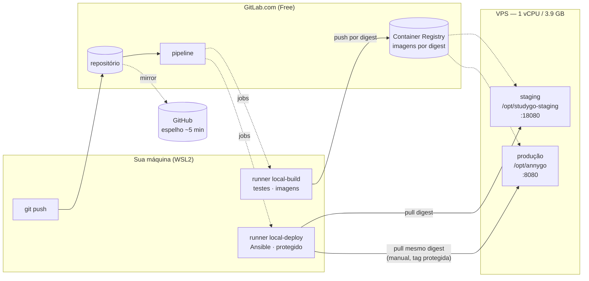

# CI/CD

O deploy não acontece mais da sua máquina. Quem publica é a pipeline do
GitLab.com, e o Ansible só promove artefatos que já passaram nos testes.

## Por que mudou

O `make deploy` antigo compilava as imagens localmente, salvava em tarball e
copiava para a VPS, identificando tudo por `:latest`. Isso significa que o que
rodava em produção não era necessariamente o que passou nos testes — bastava uma
dependência ter mudado entre um build e outro. E `:latest` pode ser reapontada,
então não havia como saber, olhando o servidor, qual versão estava no ar.

Agora a imagem é construída **uma vez**, testada de pé, publicada no Container
Registry e identificada por **digest** (`repo@sha256:...`), que é o hash do
conteúdo. Staging e produção recebem esse mesmo digest.

## O caminho de uma mudança

```
git push (main)
   │
   ├── validate ──── sintaxe da pipeline e do Ansible
   ├── lint ──────── go vet · svelte-check · ruff + mypy --strict
   ├── unit_test ─── testes dos 3 serviços + integração com Postgres real
   ├── build ─────── constrói as imagens (ainda não publica)
   ├── artifact_test  sobe as imagens e exige resposta em /health
   ├── publish ───── envia ao Registry e captura o DIGEST
   ├── deploy_staging  Ansible promove o digest → staging
   └── smoke_test ── staging responde
                            │
git tag v1.2.3              │  (mesmo digest, sem rebuild)
   └── deploy_production ◄──┘  BOTÃO MANUAL, só em tag protegida
       └── verify ───────────  produção responde
```

Cada estágio depende do anterior. Um teste vermelho não bloqueia só a si mesmo:
impede que o build sequer comece, e portanto que qualquer deploy aconteça.

## Publicar uma versão em produção

```bash
git tag v1.2.3
git push origin v1.2.3
```

A pipeline roda até `smoke_test` sozinha. Produção espera você clicar em
**deploy_production** na interface da pipeline.

Duas coisas impedem um deploy acidental de produção:

1. o job é `when: manual` e só existe em pipeline de tag;
2. a chave SSH é uma **variável protegida** — o GitLab só a injeta em jobs de
   branch ou tag protegida. Um merge request não recebe a credencial, então
   não consegue implantar mesmo que alguém tente.

## Rollback

Sem rebuild: promove-se um digest anterior.

1. abra o job `publish` da pipeline da versão que você quer de volta
2. copie os digests dos artifacts (retidos por 90 dias)
3. rode a pipeline manualmente com:

```
ROLLBACK_BACKEND_DIGEST=registry.gitlab.com/.../backend@sha256:...
ROLLBACK_FRONTEND_DIGEST=...
ROLLBACK_PROCESSOR_DIGEST=...
```

4. dispare o job `rollback_production`

> **Rollback de aplicação não reverte schema.** Se a versão que sai criou
> migrations, o banco continua migrado. Por isso migração destrutiva exige
> expand/contract: primeiro adiciona a coluna nova mantendo a antiga, e só
> remove a antiga quando nenhuma versão em uso a referencia. Entre esses dois
> passos, qualquer rollback é seguro.

## Ambientes

| | Produção | Staging |
|---|---|---|
| Domínio | cronograma.caetasousa.tech | staging.cronograma.caetasousa.tech |
| Diretório | `/opt/annygo` | `/opt/studygo-staging` |
| Banco | `annygo` | `studygo_staging` |
| Portas (loopback) | 8080 / 5173 | 18080 / 15173 |
| Deploy | manual, por tag | automático, a cada push na main |
| Segredos | próprios | próprios, distintos |

Os dois vivem **na mesma VPS** (1 vCPU, 3,9 GB). Estão isolados em tudo que
guarda estado — banco, volume, diretório, credenciais — mas compartilham CPU,
memória e disco. Uma sobrecarga em staging pode afetar produção. É o custo de
não manter um segundo servidor; se staging passar a ter uso pesado, ele precisa
sair dali.

## Runners

Rodam na sua máquina (WSL), registrados no GitLab.com como runners de **grupo**,
reusáveis pelos próximos projetos.

| Tag | Faz | Acesso |
|---|---|---|
| `local-build` | lint, testes, build de imagens | Registry |
| `local-deploy` | Ansible | SSH aos servidores; **protegido** |

Separados de propósito: o runner que constrói não tem credencial de servidor, e
o que implanta não constrói.

**Todo job declara sua tag.** Sem isso o job cairia no runner compartilhado do
GitLab.com e consumiria a cota de 400 min/mês. Com runner próprio, o consumo é
zero e não há limite de jobs.

Se o WSL estiver desligado, as pipelines ficam na fila e rodam quando ele voltar.
Nada se perde.

## Variáveis exigidas

Settings → CI/CD → Variables, todas **protegidas** e (exceto `SSH_KNOWN_HOSTS`)
**mascaradas**:

| Variável | O que é |
|---|---|
| `CI_SSH_PRIVATE_KEY` | chave privada do CI para os servidores |
| `SSH_KNOWN_HOSTS` | saída de `ssh-keyscan <ip>` — não mascarar (multilinha) |
| `CI_DEPLOY_USER` / `CI_DEPLOY_PASSWORD` | deploy token do Registry |
| `ANSIBLE_VAULT_PASSWORD` | senha do Ansible Vault |

## Rodar o Ansible à mão

Possível, mas ele **recusa** deploy sem digest:

```bash
cd ansible
ansible-playbook deploy.yml -i inventory/staging/hosts.ini \
  -e "backend_image=registry.gitlab.com/.../backend@sha256:..." \
  ...
```

Sem os digests, ou com `:latest`, o playbook falha na verificação inicial. Isso é
proposital: é a garantia de que nada não rastreável chega a um servidor.

## Arquitetura



O runner vive na sua máquina; o GitLab.com nunca inicia conexão para cá — é o
runner que busca os jobs. Por isso nada precisa ser exposto na sua rede.

## Portas, volumes e dependências

**Na VPS**

| Serviço | Porta | Exposição |
|---|---|---|
| nginx | 80, 443 | pública |
| backend produção | 8080 | loopback |
| frontend produção | 5173 | loopback |
| backend staging | 18080 | loopback |
| frontend staging | 15173 | loopback |
| postgres | — | só rede do compose |

**Volumes** (por ambiente, nomeados pelo diretório do projeto):
`postgres_data`, `edital_work`.

**DNS**: `cronograma.caetasousa.tech` e `staging.cronograma.caetasousa.tech`,
ambos apontando para a VPS.

**Dependências externas**: GitLab.com (repositório, Registry e pipeline),
Let's Encrypt (TLS) e Google Gemini (opcional, importação de edital).
