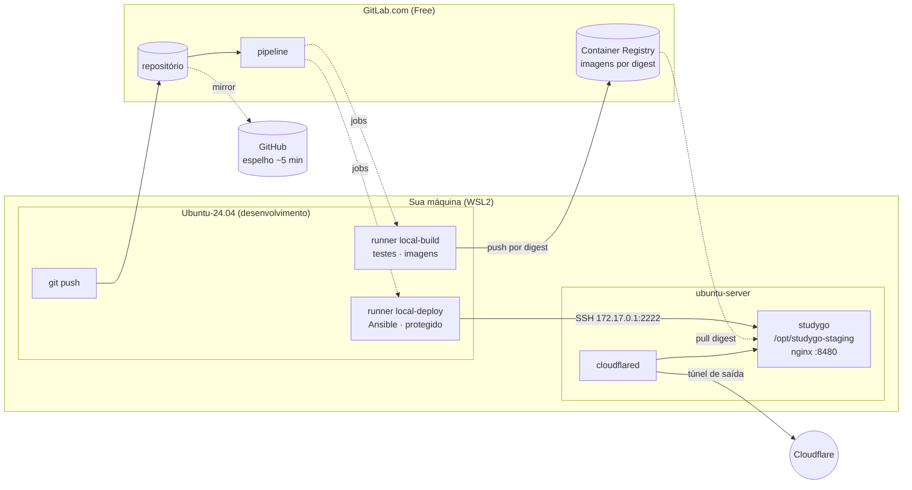

# Publicar uma versão nova

> **Em uma frase:** você envia o código, a máquina testa sozinha e, passando
> tudo, a mesma versão testada vai para o ar.

## O básico, sem termos técnicos

**Antes**, publicar era assim: você rodava um comando e o seu computador montava
o programa e mandava para o servidor.

O problema: o programa era montado na *sua* máquina. Se você tivesse uma versão
diferente de alguma ferramenta, ou tivesse esquecido de salvar um arquivo, o que
ia para o ar não era exatamente o que você testou.

**Agora**, um computador neutro faz isso: monta o programa uma vez, testa, e
guarda essa versão exata. Essa mesma versão — os mesmos bytes — é a que vai
para o servidor. Nada é montado de novo no caminho.

É como a diferença entre mandar a receita do bolo (cada um faz o seu, e sai
diferente) e mandar o bolo pronto (todo mundo recebe o mesmo).

### O comando que você precisa saber

```bash
make push      # na main: testa e, passando, publica no servidor
```

Para **voltar atrás**, é um clique: no GitLab, **Operate → Environments →
staging**, escolha a versão anterior e clique em **Rollback environment**.

---

## Detalhes técnicos

## Por que é assim

O `make deploy` antigo compilava as imagens localmente, salvava em tarball e
copiava para o servidor, identificando tudo por `:latest`. Isso significa que o
que rodava no ar não era necessariamente o que passou nos testes — bastava uma
dependência ter mudado entre um build e outro. E `:latest` pode ser reapontada,
então não havia como saber, olhando o servidor, qual versão estava no ar.

Agora a imagem é construída **uma vez**, testada de pé, publicada no Container
Registry e identificada por **digest** (`repo@sha256:...`), que é o hash do
conteúdo. O servidor recebe esse digest.

## O caminho de uma mudança

```
git push (main)
   │
   ├── validate ──── sintaxe da pipeline e do Ansible
   ├── lint ──────── go vet · svelte-check · ruff + mypy --strict
   ├── unit_test ─── testes dos 3 serviços + integração com Postgres real
   ├── build ─────── constrói as imagens (ainda não publica)
   ├── artifact_test  sobe as imagens e exige resposta em /health
   │   └── e2e ──────  o app inteiro pelo navegador, contra essas imagens
   ├── publish ───── envia ao Registry e captura o DIGEST
   ├── deploy_staging  Ansible promove o digest → servidor
   └── smoke_test ── o servidor responde

Operate → Environments → staging
   └── Rollback environment ── reexecuta o deploy_staging de uma pipeline antiga
```

Cada estágio depende do anterior. Um teste vermelho não bloqueia só a si mesmo:
impede que o build sequer comece, e portanto que qualquer deploy aconteça.

O job `e2e` é do projeto, não do template (`.gitlab-ci.yml`): roda a mesma
suíte do `make e2e` (`e2e/ci.sh`) com as imagens que o build acabou de fazer, e
o `publish` espera por ele — uma imagem que quebra um fluxo do usuário não
chega ao Registry. O relatório (`e2e/relatorio/`, com o print de cada cenário)
fica como artefato do job por 30 dias, passe ou falhe. A imagem do Playwright
(3,5 GB) é guardada no registry do runner na primeira pipeline de cada versão;
as seguintes a puxam de lá. Ao subir o `ref` do template, confira se o `needs`
do `publish` dele mudou: o do projeto repete a lista inteira.

### O que o projeto muda no template

O template (`gitlab-ci-templates`) foi escrito para dois ambientes numa VPS. O
`.gitlab-ci.yml` do projeto ajusta dois pontos:

- **Um ambiente só.** `deploy_production`, `verify` e `rollback_production`
  estão desligados (`when: never`): o servidor é um, e o nome dele na esteira é
  `staging`. Não crie tag de versão — não há para onde ela ir.
- **`smoke_test` sem domínio.** O do template consulta um domínio que não
  existe mais; o do projeto consulta o nginx do servidor por
  `172.17.0.1:8480`, o mesmo caminho que o job de deploy usa. O endereço
  público do túnel muda a cada reinício e não serve para a esteira.

O `url` do ambiente `staging` no GitLab ainda é o domínio antigo, porque vem do
template; o endereço da vez sai do `make servidor-endereco`.

## Qual versão está no ar

```bash
make servidor-health
# {"status":"ok","versao":"4de881fd","deploy":"2884592321","schema":8}
```

| Campo | O que é |
|---|---|
| `versao` | o commit que foi publicado |
| `deploy` | a pipeline que implantou |
| `schema` | a última migration aplicada no banco |

Os três vêm do deploy, não do build: a mesma imagem sobe como publicações
diferentes. Em desenvolvimento, `versao` é `dev` e `deploy` não aparece.

## Rollback

**É um botão.** No GitLab, **Operate → Environments → staging**. A lista
mostra cada publicação pelo commit; na versão para a qual quer voltar, clique
em **Rollback environment**.

O GitLab reexecuta o `deploy_staging` daquela pipeline antiga, com os digests
que ela publicou. Nada é reconstruído: sobe a mesma imagem que já esteve no ar,
pelo mesmo playbook de sempre — cópia do banco, health check e, se a versão
antiga não responder, a volta automática para a que estava.

O mesmo resultado sai pela pipeline: abra a pipeline desejada e reexecute (↻)
o job `deploy_staging`. Para republicar a versão atual sem mudar nada, é o
**Re-deploy to environment** da mesma página.

Depois, `make servidor-health` deve mostrar o commit antigo.

Duas coisas a saber:

- **O botão só aparece em versões que já foram publicadas com sucesso.** Se
  "Prevent outdated deployment jobs" estiver ligado (Settings → CI/CD →
  General pipelines), mantenha marcado "Allow job retries for rollback
  deployments" — sem ele o GitLab bloqueia a reexecução de um deploy antigo.
- **Os digests vêm dos artifacts do job `publish`**, que vencem em 90 dias. O
  GitLab guarda os da última pipeline bem-sucedida de cada ref ("Keep
  artifacts from most recent successful jobs", em Settings → CI/CD →
  Artifacts); pipelines mais antigas da `main` podem perder os seus.

### E o banco?

**Rollback de código não reverte schema.** O runner só aplica `.up.sql`: a
versão que volta encontra o banco como a outra o deixou. O `schema` do
`make servidor-health` diz onde ele está — se for maior que a última migration
da versão que voltou, o banco está à frente do código.

| A versão que sai trouxe… | O que fazer |
|---|---|
| nenhuma migration | Rollback environment, e acabou |
| migration **aditiva** (tabela, coluna, índice novos) | Rollback environment; o código antigo ignora o que não conhece |
| migration **destrutiva** (tem `-- contract:`) | o botão não basta: restaure a cópia do banco (abaixo) ou siga em frente com uma migration corretiva |

O que mantém a terceira linha vazia é expand/contract: primeiro uma publicação
que para de usar a coluna (mantendo-a), e só numa publicação **posterior** a
migration que a remove — nunca as duas na mesma. Entre esses dois passos,
qualquer rollback é seguro.

O `make check` cobra isso. Uma migration com `DROP TABLE`, `DROP COLUMN`,
`RENAME`, `ALTER COLUMN ... TYPE`, `SET NOT NULL` ou `TRUNCATE` falha o build sem
um marcador que diga quem já parou de usar o que ela tira:

```sql
-- contract: o commit 4de881f parou de ler planos.ciclo
```

O teste não tem como conferir a ordem das publicações — o marcador obriga você a
escrevê-la. `ADD COLUMN ... NOT NULL DEFAULT` é aditivo e passa sem marcador.

### Cópia do banco antes de cada deploy

Todo deploy, rollback incluído, faz um `pg_dump` antes de subir as imagens
novas: `<app_dir>/backups/pre-deploy-<data>-p<pipeline>.sql.gz`, mantidas as 5
últimas. Se a cópia falhar, o deploy é recusado antes de mexer em qualquer
coisa.

A cópia que desfaz uma versão é a que leva no nome o `deploy` que o
`make servidor-health` mostrava **com ela no ar**: foi feita imediatamente
antes daquela pipeline implantar.

Restaurar — no servidor, e só quando a árvore acima mandar:

```bash
ssh -i ~/.ssh/studygo_ci -p 2222 studygo@127.0.0.1
cd /opt/studygo-staging
export DOCKER_HOST=unix:///run/user/$(id -u)/docker.sock   # o Docker rootless

# 1. pare quem escreve no banco
docker compose stop backend worker

# 2. guarde o estado atual — ele tem o que foi escrito DEPOIS do deploy, e a
#    restauração vai descartar isso
docker compose exec -T postgres pg_dump -U studygo_staging studygo_staging \
  | gzip > backups/antes-da-restauracao-$(date +%Y%m%d-%H%M%S).sql.gz

# 3. recrie o banco a partir da cópia
ls -1t backups/
docker compose exec -T postgres psql -U studygo_staging -d postgres -v ON_ERROR_STOP=1 \
  -c 'DROP DATABASE studygo_staging WITH (FORCE)' \
  -c 'CREATE DATABASE studygo_staging OWNER studygo_staging'
gunzip -c backups/pre-deploy-AAAAMMDD-HHMMSS-pNNNN.sql.gz \
  | docker compose exec -T postgres psql -U studygo_staging -d studygo_staging -v ON_ERROR_STOP=1 >/dev/null
```

4. No GitLab, **Rollback environment** para a versão anterior. É ele que sobe o
   backend e o worker de novo, com o código que entende aquele schema.

O que foi escrito entre o deploy e a restauração fica só na cópia do passo 2 —
recuperar isso, se for o caso, é consulta à mão naquele arquivo.

## O ambiente

| | staging |
|---|---|
| Servidor | distro `ubuntu-server` do WSL, usuário `studygo` ([deploy.md](deploy.md)) |
| Endereço | `*.trycloudflare.com`, muda a cada reinício — `make servidor-endereco` ([cloudflare-tunnel.md](cloudflare-tunnel.md)) |
| Diretório | `/opt/studygo-staging` |
| Banco | `studygo_staging` |
| Deploy | automático, a cada push na main |

## Runners

Rodam na sua máquina (a distro de desenvolvimento do WSL), registrados no
GitLab.com como runners de **grupo**, reusáveis pelos próximos projetos.

| Tag | Faz | Acesso |
|---|---|---|
| `local-build` | lint, testes, build de imagens | Registry |
| `local-deploy` | Ansible | SSH ao servidor; **protegido** |

Separados de propósito: o runner que constrói não tem credencial de servidor, e
o que implanta não constrói.

**Todo job declara sua tag.** Sem isso o job cairia no runner compartilhado do
GitLab.com e consumiria a cota de 400 min/mês. Com runner próprio, o consumo é
zero e não há limite de jobs.

Os jobs rodam em containers do Docker da distro de desenvolvimento e chegam ao
servidor por `172.17.0.1` (o `docker0` dela, na rede que todas as distros
dividem): SSH na 2222, nginx na 8480.

Se o WSL estiver desligado, as pipelines ficam na fila e rodam quando ele voltar.
Nada se perde.

## Variáveis exigidas

Settings → CI/CD → Variables, todas **protegidas** e (exceto `SSH_KNOWN_HOSTS`)
**mascaradas**:

| Variável | O que é |
|---|---|
| `CI_SSH_PRIVATE_KEY` | a chave privada `~/.ssh/studygo_ci`, do usuário `studygo` no servidor |
| `SSH_KNOWN_HOSTS` | saída de `ssh-keyscan -p 2222 172.17.0.1` — não mascarar (multilinha); o job tira dela o endereço do servidor |
| `CI_DEPLOY_USER` / `CI_DEPLOY_PASSWORD` | deploy token do Registry |
| `ANSIBLE_VAULT_PASSWORD` | senha do Ansible Vault |
| `ANSIBLE_SECRETS` | o `secrets.yml` do servidor, cifrado |

## Não existe deploy à mão

Todo deploy passa por aqui. Não há atalho, e não é para criar um.

O playbook até recusa sozinho o que não for rastreável — sem digest, ou com
`:latest`, ele falha na verificação inicial. Mas a recusa é a última linha de
defesa, não o procedimento: rodar o Ansible da sua máquina implanta um artefato
que ninguém testou naquela combinação e pula o `smoke_test`.

Precisa voltar atrás rápido? **Rollback environment**, em Operate →
Environments, promove um digest anterior sem reconstruir nada.

## Arquitetura



O runner vive na sua máquina; o GitLab.com nunca inicia conexão para cá — é o
runner que busca os jobs. E o túnel também é de saída. Por isso nada precisa
ser exposto na sua rede.

## Portas, volumes e dependências

**No servidor**

| Serviço | Porta | Exposição |
|---|---|---|
| sshd | 2222 | rede do WSL (só chave) |
| nginx | 8480 | rede do WSL; público só pelo túnel |
| backend | 18080 | loopback |
| frontend | 15173 | loopback |
| postgres | — | só rede do compose |

**Volumes** (nomeados pelo diretório do projeto): `postgres_data`,
`edital_work`.

**Dependências externas**: GitLab.com (repositório, Registry e pipeline),
Cloudflare (túnel e HTTPS) e Google Gemini (opcional, importação de edital).
