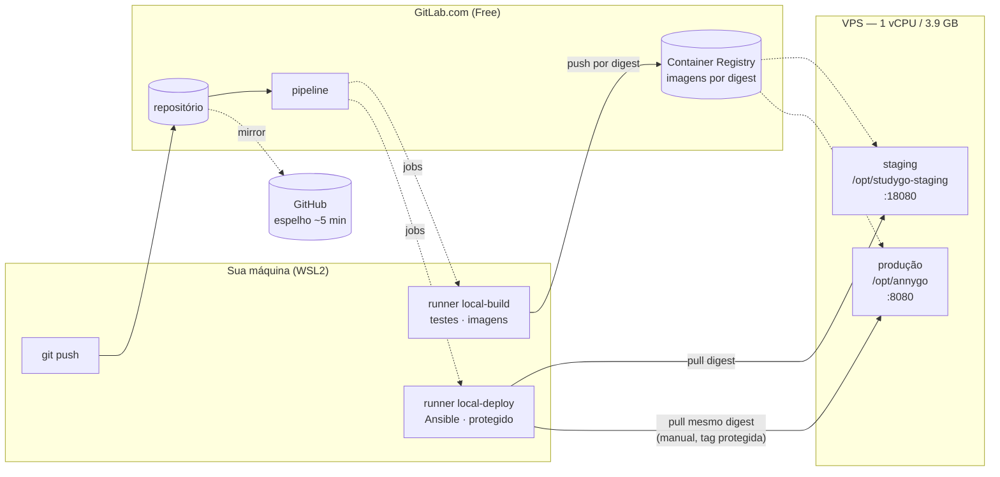

# Publicar uma versão nova

> **Em uma frase:** você envia o código, a máquina testa sozinha, e você clica
> num botão para colocar no ar.

## O básico, sem termos técnicos

**Antes**, publicar era assim: você rodava um comando e o seu computador montava
o programa e mandava para o servidor.

O problema: o programa era montado na *sua* máquina. Se você tivesse uma versão
diferente de alguma ferramenta, ou tivesse esquecido de salvar um arquivo, o que
ia para o ar não era exatamente o que você testou.

**Agora**, um computador neutro faz isso: monta o programa uma vez, testa, e
guarda essa versão exata. Essa mesma versão — os mesmos bytes — é a que vai para
teste e depois para produção. Nada é montado de novo no caminho.

É como a diferença entre mandar a receita do bolo (cada um faz o seu, e sai
diferente) e mandar o bolo pronto (todo mundo recebe o mesmo).

### Os comandos que você precisa saber

```bash
# 1. publica no ambiente de TESTE (staging)
make push

# 2. prepara uma versão para PRODUÇÃO
make release          # mostra o nome da versão e o que vai nela
make release go=1     # cria a versão e manda para o GitLab
```

Depois do segundo, vá ao site do GitLab e clique no botão de publicar. Produção
sempre exige esse clique — nada vai para o ar sozinho.

Para **voltar atrás**, é outro clique: no GitLab, **Operate → Environments →
production**, escolha a versão anterior e clique em **Rollback environment**.

---

## Detalhes técnicos

## Por que mudou

O `make deploy` antigo compilava as imagens localmente, salvava em tarball e
copiava para a VPS, identificando tudo por `:latest`. Isso significa que o que
rodava em produção não era necessariamente o que passou nos testes — bastava uma
dependência ter mudado entre um build e outro. E `:latest` pode ser reapontada,
então não havia como saber, olhando o servidor, qual versão estava no ar.

Agora a imagem é construída **uma vez**, testada de pé, publicada no Container
Registry e identificada por **digest** (`repo@sha256:...`), que é o hash do
conteúdo. Staging e produção recebem esse mesmo digest.

## O caminho de uma mudança

```
git push (main)
   │
   ├── validate ──── sintaxe da pipeline e do Ansible
   ├── lint ──────── go vet · svelte-check · ruff + mypy --strict
   ├── unit_test ─── testes dos 3 serviços + integração com Postgres real
   ├── build ─────── constrói as imagens (ainda não publica)
   ├── artifact_test  sobe as imagens e exige resposta em /health
   ├── publish ───── envia ao Registry e captura o DIGEST
   ├── deploy_staging  Ansible promove o digest → staging
   └── smoke_test ── staging responde
                            │
make release go=1           │  (tag v2026.09.12, mesmo digest, sem rebuild)
   └── deploy_production ◄──┘  BOTÃO MANUAL, só em tag protegida
       └── verify ───────────  produção responde

Operate → Environments
   └── Rollback environment ── reexecuta o deploy_production de uma tag antiga
```

Cada estágio depende do anterior. Um teste vermelho não bloqueia só a si mesmo:
impede que o build sequer comece, e portanto que qualquer deploy aconteça.

## Publicar uma versão em produção

```bash
make release          # mostra a tag, a anterior e os commits que entram
make release go=1     # cria a tag anotada e a envia ao GitLab
```

A versão é a data: `v2026.09.12`, e `v2026.09.12.1` se houver uma segunda no
mesmo dia. O que se quer saber de uma versão no ar é de quando ela é — a
numeração antiga não dizia nada, e `v1.0.0` e `v1.0.1` apontam para o mesmo
commit. A tag é sempre anotada, com os commits desde a anterior: é o changelog.

`make release` recusa quando:

| Recusa | Por quê |
|---|---|
| fora da `main` | produção sai da main |
| árvore suja | o que você vê não é o que vai |
| `HEAD` diferente de `gitlab/main` | staging não testou este commit |
| o commit já tem tag | não há nada novo; reimplantar é **Re-deploy** (ver Rollback) |

A tag vai para o remote `gitlab`, nunca para o `origin` — o `origin` é o espelho
do GitHub, que não roda pipeline, e uma tag enviada para lá nunca libera
produção.

A pipeline da tag roda até `smoke_test` sozinha. Produção espera você clicar em
**deploy_production** na interface da pipeline.

Duas coisas impedem um deploy acidental de produção:

1. o job é `when: manual` e só existe em pipeline de tag;
2. a chave SSH é uma **variável protegida** — o GitLab só a injeta em jobs de
   branch ou tag protegida. Um merge request não recebe a credencial, então
   não consegue implantar mesmo que alguém tente.

## Qual versão está no ar

```bash
make health env=production
# {"status":"ok","versao":"v2026.09.12","deploy":"2034411922","schema":3}
# implantado pela pipeline https://gitlab.com/caetasousa/studygo/-/pipelines/2034411922
```

| Campo | O que é |
|---|---|
| `versao` | a tag; num deploy da `main` (staging), o commit |
| `deploy` | a pipeline que implantou |
| `schema` | a última migration aplicada no banco |

Os três vêm do deploy, não do build: a mesma imagem sobe como publicações
diferentes. Em desenvolvimento, `versao` é `dev` e `deploy` não aparece.

## Rollback

**É um botão, como o de produção.** No GitLab, **Operate → Environments →
production**. A lista mostra cada publicação pela tag; na versão para a qual
quer voltar, clique em **Rollback environment**.

O GitLab reexecuta o `deploy_production` daquela pipeline antiga, com os
digests que ela publicou. Nada é reconstruído: sobe a mesma imagem que já esteve
no ar, pelo mesmo playbook de sempre — cópia do banco, health check e, se a
versão antiga não responder, a volta automática para a que estava.

O mesmo resultado sai pela pipeline: abra a pipeline da tag desejada e
reexecute (↻) o job `deploy_production`. Para republicar a versão atual sem
mudar nada, é o **Re-deploy to environment** da mesma página.

Depois, `make health env=production` deve mostrar a tag antiga.

Três coisas a saber:

- **O botão só aparece em versões que já foram para produção com sucesso.**
  Se "Prevent outdated deployment jobs" estiver ligado (Settings → CI/CD →
  General pipelines), mantenha marcado "Allow job retries for rollback
  deployments" — sem ele o GitLab bloqueia a reexecução de um deploy antigo.
- **Os digests vêm dos artifacts do job `publish`.** Eles vencem em 90 dias,
  mas o GitLab guarda os da última pipeline bem-sucedida de cada ref, e cada tag
  é uma ref: toda versão publicada conserva os seus. Isso depende de "Keep
  artifacts from most recent successful jobs" (Settings → CI/CD → Artifacts),
  ligado por padrão.
- **O `rollback_production` do template está desligado** neste projeto, no
  `.gitlab-ci.yml`: ele pedia três digests colados à mão e falhava ao decifrar
  os segredos.

### E o banco?

**Rollback de código não reverte schema.** O runner só aplica `.up.sql`: a
versão que volta encontra o banco como a outra o deixou. O `schema` do
`make health` diz onde ele está — se for maior que a última migration da versão
que voltou, o banco está à frente do código.

| A versão que sai trouxe… | O que fazer |
|---|---|
| nenhuma migration | Rollback environment, e acabou |
| migration **aditiva** (tabela, coluna, índice novos) | Rollback environment; o código antigo ignora o que não conhece |
| migration **destrutiva** (tem `-- contract:`) | o botão não basta: restaure a cópia do banco (abaixo) ou siga em frente com uma migration corretiva |

O que mantém a terceira linha vazia é expand/contract: primeiro uma publicação
que para de usar a coluna (mantendo-a), e só numa publicação **posterior** a
migration que a remove — nunca as duas na mesma. Entre esses dois passos,
qualquer rollback é seguro.

O `make check` cobra isso. Uma migration com `DROP TABLE`, `DROP COLUMN`,
`RENAME`, `ALTER COLUMN ... TYPE`, `SET NOT NULL` ou `TRUNCATE` falha o build sem
um marcador que diga quem já parou de usar o que ela tira:

```sql
-- contract: a versão v2026.09.05 parou de ler planos.ciclo
```

O teste não tem como conferir a ordem das publicações — o marcador obriga você a
escrevê-la. `ADD COLUMN ... NOT NULL DEFAULT` é aditivo e passa sem marcador.

### Cópia do banco antes de cada deploy

Todo deploy, staging e produção, rollback incluído, faz um `pg_dump` antes de
subir as imagens novas: `<app_dir>/backups/pre-deploy-<data>-p<pipeline>.sql.gz`,
mantidas as 5 últimas. Se a cópia falhar, o deploy é recusado antes de mexer em
qualquer coisa.

A cópia que desfaz uma versão é a que leva no nome o `deploy` que o
`make health` mostrava **com ela no ar**: foi feita imediatamente antes daquela
pipeline implantar.

Restaurar — na VPS, e só quando a árvore acima mandar:

```bash
ssh annyGo@SEU_IP
sudo -i
cd /opt/annygo      # staging: /opt/studygo-staging, usuário e banco studygo_staging

# 1. pare quem escreve no banco
docker compose stop backend worker

# 2. guarde o estado atual — ele tem o que foi escrito DEPOIS do deploy, e a
#    restauração vai descartar isso
docker compose exec -T postgres pg_dump -U annygo annygo \
  | gzip > backups/antes-da-restauracao-$(date +%Y%m%d-%H%M%S).sql.gz

# 3. recrie o banco a partir da cópia
ls -1t backups/
docker compose exec -T postgres psql -U annygo -d postgres -v ON_ERROR_STOP=1 \
  -c 'DROP DATABASE annygo WITH (FORCE)' -c 'CREATE DATABASE annygo OWNER annygo'
gunzip -c backups/pre-deploy-AAAAMMDD-HHMMSS-pNNNN.sql.gz \
  | docker compose exec -T postgres psql -U annygo -d annygo -v ON_ERROR_STOP=1 >/dev/null
```

4. No GitLab, **Rollback environment** para a versão anterior. É ele que sobe o
   backend e o worker de novo, com o código que entende aquele schema.

O que foi escrito entre o deploy e a restauração fica só na cópia do passo 2 —
recuperar isso, se for o caso, é consulta à mão naquele arquivo.

## Ambientes

| | Produção | Staging |
|---|---|---|
| Domínio | cronograma.caetasousa.tech | staging.cronograma.caetasousa.tech |
| Diretório | `/opt/annygo` | `/opt/studygo-staging` |
| Banco | `annygo` | `studygo_staging` |
| Portas (loopback) | 8080 / 5173 | 18080 / 15173 |
| Deploy | manual, por tag | automático, a cada push na main |
| Segredos | próprios | próprios, distintos |

Os dois vivem **na mesma VPS** (1 vCPU, 3,9 GB). Estão isolados em tudo que
guarda estado — banco, volume, diretório, credenciais — mas compartilham CPU,
memória e disco. Uma sobrecarga em staging pode afetar produção. É o custo de
não manter um segundo servidor; se staging passar a ter uso pesado, ele precisa
sair dali.

## Runners

Rodam na sua máquina (WSL), registrados no GitLab.com como runners de **grupo**,
reusáveis pelos próximos projetos.

| Tag | Faz | Acesso |
|---|---|---|
| `local-build` | lint, testes, build de imagens | Registry |
| `local-deploy` | Ansible | SSH aos servidores; **protegido** |

Separados de propósito: o runner que constrói não tem credencial de servidor, e
o que implanta não constrói.

**Todo job declara sua tag.** Sem isso o job cairia no runner compartilhado do
GitLab.com e consumiria a cota de 400 min/mês. Com runner próprio, o consumo é
zero e não há limite de jobs.

Se o WSL estiver desligado, as pipelines ficam na fila e rodam quando ele voltar.
Nada se perde.

## Variáveis exigidas

Settings → CI/CD → Variables, todas **protegidas** e (exceto `SSH_KNOWN_HOSTS`)
**mascaradas**:

| Variável | O que é |
|---|---|
| `CI_SSH_PRIVATE_KEY` | chave privada do CI para os servidores |
| `SSH_KNOWN_HOSTS` | saída de `ssh-keyscan <ip>` — não mascarar (multilinha) |
| `CI_DEPLOY_USER` / `CI_DEPLOY_PASSWORD` | deploy token do Registry |
| `ANSIBLE_VAULT_PASSWORD` | senha do Ansible Vault |

## Não existe deploy à mão

Todo deploy passa por aqui, e sempre nesta ordem: **staging primeiro, produção
depois**. Não há atalho, e não é para criar um.

O playbook até recusa sozinho o que não for rastreável — sem digest, ou com
`:latest`, ele falha na verificação inicial. Mas a recusa é a última linha de
defesa, não o procedimento: rodar o Ansible da sua máquina implanta um artefato
que ninguém testou naquela combinação, e pula o `smoke_test` que é justamente
quem autoriza produção.

Precisa voltar atrás rápido? **Rollback environment**, em Operate →
Environments, promove um digest anterior sem reconstruir nada.

## Arquitetura



O runner vive na sua máquina; o GitLab.com nunca inicia conexão para cá — é o
runner que busca os jobs. Por isso nada precisa ser exposto na sua rede.

## Portas, volumes e dependências

**Na VPS**

| Serviço | Porta | Exposição |
|---|---|---|
| nginx | 80, 443 | pública |
| backend produção | 8080 | loopback |
| frontend produção | 5173 | loopback |
| backend staging | 18080 | loopback |
| frontend staging | 15173 | loopback |
| postgres | — | só rede do compose |

**Volumes** (por ambiente, nomeados pelo diretório do projeto):
`postgres_data`, `edital_work`.

**DNS**: `cronograma.caetasousa.tech` e `staging.cronograma.caetasousa.tech`,
ambos apontando para a VPS.

**Dependências externas**: GitLab.com (repositório, Registry e pipeline),
Let's Encrypt (TLS) e Google Gemini (opcional, importação de edital).
